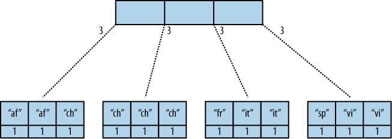
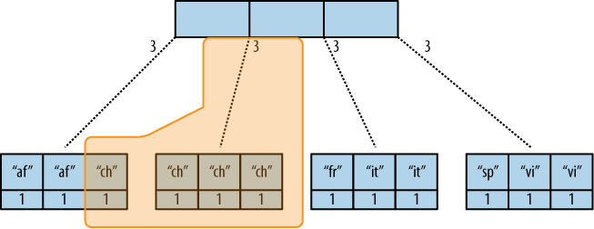

.. Licensed under the Apache License, Version 2.0 (the "License"); you may not
.. use this file except in compliance with the License. You may obtain a copy of
.. the License at
..
..   http://www.apache.org/licenses/LICENSE-2.0
..
.. Unless required by applicable law or agreed to in writing, software
.. distributed under the License is distributed on an "AS IS" BASIS, WITHOUT
.. WARRANTIES OR CONDITIONS OF ANY KIND, either express or implied. See the
.. License for the specific language governing permissions and limitations under
.. the License.

.. _views/intro:

===========================
Introduction Into The Views
===========================

Views are useful for many purposes:

- Filtering the documents in your database to find those relevant to a
  particular process.
- Extracting data from your documents and presenting it in a specific order.
- Building efficient indexes to find documents by any value or structure that
  resides in them.
- Use these indexes to represent relationships among documents.
- Finally, with views you can make all sorts of calculations on the data in your
  documents. For example, if documents represent your company’s financial
  transactions, a view can answer the question of what the spending was in the
  last week, month, or year.

What Is a View?
===============

Let’s go through the different use cases. First is extracting data that you
might need for a special purpose in a specific order. For a front page, we want
a list of blog post titles sorted by date. We’ll work with a set of example
documents as we walk through how views work:

.. code-block:: javascript

  {
    "_id":"biking",
    "_rev":"AE19EBC7654",

    "title":"Biking",
    "body":"My biggest hobby is mountainbiking. The other day...",
    "date":"2009/01/30 18:04:11"
  }

.. code-block:: javascript

  {
    "_id":"bought-a-cat",
    "_rev":"4A3BBEE711",

    "title":"Bought a Cat",
    "body":"I went to the the pet store earlier and brought home a little kitty...",
    "date":"2009/02/17 21:13:39"
  }

.. code-block:: javascript

  {
    "_id":"hello-world",
    "_rev":"43FBA4E7AB",

    "title":"Hello World",
    "body":"Well hello and welcome to my new blog...",
    "date":"2009/01/15 15:52:20"
  }

Three will do for the example. Note that the documents are sorted by "_id",
which is how they are stored in the database. Now we define a view.
Bear with us without an explanation while we show you some code:

.. code-block:: javascript

  function(doc) {
    if(doc.date && doc.title) {
      emit(doc.date, doc.title);
    }
  }

This is a `map function`, and it is written in JavaScript. If you are not
familiar with JavaScript but have used C or any other C-like language such as
Java, PHP, or C#, this should look familiar. It is a simple function definition.

You provide CouchDB with view functions as strings stored inside the ``views``
field of a design document. You don’t run it yourself. Instead, when you
`query your view`, CouchDB takes the source code and runs it for you on every
document in the database your view was defined in. You `query your view` to
retrieve the `view result`.

All map functions have a single parameter doc. This is a single document in
the database. Our map function checks whether our document has a ``date`` and
a ``title`` attribute — luckily, all of our documents have them — and then calls
the built-in :js:func:`emit` function with these two attributes as arguments.

The :js:func:`emit` function always takes two arguments: the first is ``key``,
and the second is ``value``. The ``emit(key, value)`` function creates an entry
in our `view result`. One more thing: the ``emit()`` function can be called
multiple times in the map function to create multiple entries in the view
results from a single document, but we are not doing that yet.

CouchDB takes whatever you pass into the emit() function and puts it into a list
(see Table 1, “View results” below). Each row in that list includes the `key`
and `value`. More importantly, the list is sorted by key (by ``doc.date``
in our case).  The most important feature of a view result is that it is sorted
by `key`. We will come back to that over and over again to do neat things. Stay
tuned.

Table 1. View results:

+-----------------------+------------------+
|         Key           |      Value       |
+=======================+==================+
| "2009/01/15 15:52:20" | "Hello World"    |
+-----------------------+------------------+
| "2009/01/30 18:04:11" | "Biking"         |
+-----------------------+------------------+
| "2009/02/17 21:13:39" | "Bought a Cat"   |
+-----------------------+------------------+

When you query your view, CouchDB takes the source code and runs it for you on
every document in the database. If you have a lot of documents, that takes
quite a bit of time and you might wonder if it is not horribly inefficient
to do this. Yes, it would be, but CouchDB is designed to avoid any extra costs:
it only runs through all documents once, when you first query your view.
If a document is changed, the map function is only run once, to recompute
the keys and values for that single document.

The view result is stored in a B-tree, just like the structure that is
responsible for holding your documents. View B-trees are stored in their
own file, so that for high-performance CouchDB usage, you can keep views on
their own disk. The B-tree provides very fast lookups of rows by key, as well
as efficient streaming of rows in a key range. In our example, a single view
can answer all questions that involve time: “Give me all the blog posts from
last week” or “last month” or “this year.” Pretty neat.

When we query our view, we get back a list of all documents sorted by date.
Each row also includes the post title so we can construct links to posts.
Table 1 is just a graphical representation of the view result.
The actual result is JSON-encoded and contains a little more metadata:

.. code-block:: javascript

  {
    "total_rows": 3,
    "offset": 0,
    "rows": [
      {
        "key": "2009/01/15 15:52:20",
        "id": "hello-world",
        "value": "Hello World"
      },

      {
        "key": "2009/01/30 18:04:11",
        "id": "biking",
        "value": "Biking"
      },

      {
        "key": "2009/02/17 21:13:39",
        "id": "bought-a-cat",
        "value": "Bought a Cat"
      }

    ]
  }

Now, the actual result is not as nicely formatted and doesn’t include any
superfluous whitespace or newlines, but this is better for you (and us!)
to read and understand. Where does that "id" member in the result rows come
from? That wasn’t there before. That’s because we omitted it earlier to avoid
confusion. CouchDB automatically includes the document ID of the document that
created the entry in the view result. We’ll use this as well when constructing
links to the blog post pages.

Efficient Lookups
=================

Let’s move on to the second use case for views: “building efficient indexes to
find documents by any value or structure that resides in them.” We already
explained the efficient indexing, but we skipped a few details. This is a good
time to finish this discussion as we are looking at map functions that are a
little more complex.

First, back to the B-trees! We explained that the B-tree that backs the
key-sorted view result is built only once, when you first query a view,
and all subsequent queries will just read the B-tree instead of executing
the map function for all documents again. What happens, though, when you change
a document, add a new one, or delete one? Easy: CouchDB is smart enough
to find the rows in the view result that were created by a specific document.
It marks them invalid so that they no longer show up in view results.
If the document was deleted, we’re good — the resulting B-tree reflects the
state of the database. If a document got updated, the new document is run
through the map function and the resulting new lines are inserted into
the B-tree at the correct spots. New documents are handled in the same way.
The B-tree is a very efficient data structure for our needs, and the crash-only
design of CouchDB databases is carried over to the view indexes as well.

To add one more point to the efficiency discussion: usually multiple documents
are updated between view queries. The mechanism explained in the previous
paragraph gets applied to all changes in the database since the last time
the view was queried in a batch operation, which makes things even faster and
is generally a better use of your resources.

Find One
--------

On to more complex map functions. We said “find documents by any value or
structure that resides in them.” We already explained how to extract a value
by which to sort a list of views (our date field). The same mechanism is used
for fast lookups. The URI to query to get a view’s result is
``/database/_design/designdocname/_view/viewname``. This gives you a list of all
rows in the view. We have only three documents, so things are small, but with
thousands of documents, this can get long. You can add view parameters to the
URI to constrain the result set. Say we know the date of a blog post.
To find a single document, we would use
``/blog/_design/docs/_view/by_date?key="2009/01/30 18:04:11"``
to get the “Biking” blog post. Remember that you can place whatever you like
in the key parameter to the emit() function. Whatever you put in there, we can
now use to look up exactly — and fast.

Note that in the case where multiple rows have the same key (perhaps we design
a view where the key is the name of the post’s author), key queries can return
more than one row.

Find Many
---------

We talked about “getting all posts for last month.” If it’s February now,
this is as easy as ``/blog/_design/docs/_view/by_date?startkey="2010/01/01 00:00:00"&endkey="2010/02/00 00:00:00"``.
The ``startkey`` and ``endkey`` parameters specify an inclusive range on which
we can search.

To make things a little nicer and to prepare for a future example, we are going
to change the format of our date field. Instead of a string, we are going to use
an array, where individual members are part of a timestamp in decreasing
significance. This sounds fancy, but it is rather easy. Instead of::

  {
    "date": "2009/01/31 00:00:00"
  }

we use::

  {
    "date": [2009, 1, 31, 0, 0, 0]
  }

Our map function does not have to change for this, but our view result looks
a little different:

Table 2. New view results:

+---------------------------+------------------+
|            Key            |      Value       |
+===========================+==================+
| [2009, 1, 15, 15, 52, 20] | "Hello World"    |
+---------------------------+------------------+
| [2009, 2, 17, 21, 13, 39] | "Biking"         |
+---------------------------+------------------+
| [2009, 1, 30, 18, 4, 11]  | "Bought a Cat"   |
+---------------------------+------------------+

And our queries change to ``/blog/_design/docs/_view/by_date?startkey=[2010, 1, 1, 0, 0, 0]&endkey=[2010, 2, 1, 0, 0, 0]``.
For all you care, this is just a change in syntax, not meaning. But it shows
you the power of views. Not only can you construct an index with scalar values
like strings and integers, you can also use JSON structures as keys for your
views. Say we tag our documents with a list of tags and want to see all tags,
but we don’t care for documents that have not been tagged.

.. code-block:: javascript

  {
    ...
    tags: ["cool", "freak", "plankton"],
    ...
  }

.. code-block:: javascript

  {
    ...
    tags: [],
    ...
  }

.. code-block:: javascript

  function(doc) {
    if(doc.tags.length > 0) {
      for(var idx in doc.tags) {
        emit(doc.tags[idx], null);
      }
    }
  }

This shows a few new things. You can have conditions on structure
(``if(doc.tags.length > 0)``) instead of just values. This is also an example of
how a map function calls :js:func:`emit` multiple times per document.
And finally, you can pass null instead of a value to the value parameter.
The same is true for the key parameter. We’ll see in a bit how that is useful.

Reversed Results
----------------

To retrieve view results in reverse order, use the ``descending=true`` query
parameter. If you are using a ``startkey`` parameter, you will find that CouchDB
returns different rows or no rows at all. What’s up with that?

It’s pretty easy to understand when you see how view query options work under
the hood. A view is stored in a tree structure for fast lookups. Whenever you
query a view, this is how CouchDB operates:

#. Starts reading at the top, or at the position that ``startkey`` specifies,
   if present.
#. Returns one row at a time until the end or until it hits ``endkey``,
   if present.

If you specify ``descending=true``, the reading direction is reversed,
not the sort  order of the rows in the view. In addition, the same two-step
procedure is followed.

Say you have a view result that looks like this:

+-----+-------+
| Key | Value |
+=====+=======+
|  0  | "foo" |
+-----+-------+
|  1  | "bar" |
+-----+-------+
|  2  | "baz" |
+-----+-------+

Here are potential query options: ``?startkey=1&descending=true``. What will
CouchDB do? See #1 above: it jumps to ``startkey``, which is the row with the
key ``1``, and starts reading backward until it hits the end of the view.
So the particular result would be:

+-----+-------+
| Key | Value |
+=====+=======+
|  1  | "bar" |
+-----+-------+
|  0  | "foo" |
+-----+-------+

This is very likely not what you want. To get the rows with the indexes ``1``
and ``2`` in reverse order, you need to switch the ``startkey`` to ``endkey``:
``endkey=1&descending=true``:

+-----+-------+
| Key | Value |
+=====+=======+
|  2  | "baz" |
+-----+-------+
|  1  | "bar" |
+-----+-------+

Now that looks a lot better. CouchDB started reading at the bottom of the view
and went backward until it hit ``endkey``.

The View to Get Comments for Posts
==================================

We use an array key here to support the ``group_level`` reduce query parameter.
CouchDB’s views are stored in the B-tree file structure. Because of the way
B-trees are structured, we can cache the intermediate reduce results in the
non-leaf nodes of the tree, so reduce queries can be computed along arbitrary
key ranges in logarithmic time. See Figure 1, “Comments map function”.

In the blog app, we use ``group_level`` reduce queries to compute the count of
comments both on a per-post and total basis, achieved by querying the same view
index with different methods. With some array keys, and assuming each key has
the value ``1``:

.. code-block:: javascript

  ["a","b","c"]
  ["a","b","e"]
  ["a","c","m"]
  ["b","a","c"]
  ["b","a","g"]

the reduce view:

.. code-block:: javascript

  function(keys, values, rereduce) {
    return sum(values)
  }

returns the total number of rows between the start and end key.
So with ``startkey=["a","b"]&endkey=["b"]`` (which includes the first three of
the above keys) the result would equal ``3``. The effect is to count rows.
If you’d like to count rows without depending on the row value, you can switch
on the ``rereduce`` parameter:

.. code-block:: javascript

  function(keys, values, rereduce) {
    if (rereduce) {
      return sum(values);
    } else {
      return values.length;
    }
  }

.. note::

   JavaScript function about could be effectively replaced by builtin ``_count``
   one.

.. figure:: ../../../images/views-intro-01.png
   :align: center
   :scale: 50 %
   :alt:  Comments map function

   Figure 1. Comments map function

This is the reduce view used by the example app to count comments, while
utilizing the map to output the comments, which are more useful than just
``1`` over and over. It pays to spend some time playing around with map and
reduce functions. Futon is OK for this, but it doesn’t give full access to all
the query parameters. Writing your own test code for views in your language
of choice is a great way to explore the nuances and capabilities of CouchDB’s
incremental MapReduce system.

Anyway, with a ``group_level`` query, you’re basically running a series of
reduce range queries: one for each group that shows up at the level you query.
Let’s reprint the key list from earlier, grouped at level ``1``:

.. code-block:: javascript

  ["a"]   3
  ["b"]   2

And at ``group_level=2``:

.. code-block:: javascript

  ["a","b"]   2
  ["a","c"]   1
  ["b","a"]   2

Using the parameter ``group=true`` makes it behave as though it were
``group_level=exact``, so in the case of our current example, it would give the
number ``1`` for each key, as there are no exactly duplicated keys.

Reduce/Rereduce
===============

We briefly talked about the ``rereduce`` parameter to your reduce function.
We’ll explain what’s up with it in this section. By now, you should have learned
that your view result is stored in B-tree index structure for efficiency.
The existence and use of the ``rereduce`` parameter is tightly coupled to how
the B-tree index works.

Consider the map result are:

.. code-block:: javascript

  "afrikan", 1
  "afrikan", 1
  "chinese", 1
  "chinese", 1
  "chinese", 1
  "chinese", 1
  "french", 1
  "italian", 1
  "italian", 1
  "spanish", 1
  "vietnamese", 1
  "vietnamese", 1

Example 1. Example view result (mmm, food)

When we want to find out how many dishes there are per origin, we can reuse
the simple reduce function shown earlier:

.. code-block:: javascript

  function(keys, values, rereduce) {
    return sum(values);
  }

Figure 2, “The B-tree index” shows a simplified version of what the B-tree index
looks like. We abbreviated the key strings.

   Figure 2. The B-tree index

The view result is what computer science grads call a “pre-order” walk through
the tree. We look at each element in each node starting from the left. Whenever
we see that there is a subnode to descend into, we descend and start reading
the elements in that subnode. When we have walked through the entire tree,
we’re done.

You can see that CouchDB stores both keys and values inside each leaf node.
In our case, it is simply always ``1``, but you might have a value where you
count other results and then all rows have a different value. What’s important
is that CouchDB runs all elements that are within a node into the reduce
function (setting the ``rereduce`` parameter to false) and stores the result
inside the parent node along with the edge to the subnode. In our case, each
edge has a 3 representing the reduce value for the node it points to.

.. note::

   In reality, nodes have more than 1,600 elements in them. CouchDB computes
   the result for all the elements in multiple iterations over the elements in
   a single node, not all at once (which would be disastrous for memory
   consumption).

Now let’s see what happens when we run a query. We want to know how many
"chinese" entries we have. The query option is simple: ``?key="chinese"``.
See Figure 3, “The B-tree index reduce result”.

   Figure 3. The B-tree index reduce result

CouchDB detects that all values in the subnode include the "chinese" key.
It concludes that it can take just the 3 values associated with that node to
compute the final result. It then finds the node left to it and sees that it’s
a node with keys outside the requested range (``key=`` requests a range where
the beginning and the end are the same value). It concludes that it has to use
the "chinese" element’s value and the other node’s value and run them through
the reduce function with the ``rereduce`` parameter set to true.

The reduce function effectively calculates 3 + 1 on query time and returns the
desired result. The next example shows some pseudocode that shows the last
invocation of the reduce function with actual values:

.. code-block:: javascript

  function(null, [3, 1], true) {
    return sum([3, 1]);
  }

Now, we said your reduce function must actually reduce your values. If you see
the B-tree, it should become obvious what happens when you don’t reduce your
values. Consider the following map result and reduce function. This time we
want to get a list of all the unique labels in our view:

.. code-block:: javascript

  "abc", "afrikan"
  "cef", "afrikan"
  "fhi", "chinese"
  "hkl", "chinese"
  "ino", "chinese"
  "lqr", "chinese"
  "mtu", "french"
  "owx", "italian"
  "qza", "italian"
  "tdx", "spanish"
  "xfg", "vietnamese"
  "zul", "vietnamese"

We don’t care for the key here and only list all the labels we have. Our reduce
function removes duplicates:

.. code-block:: javascript

  function(keys, values, rereduce) {
    var unique_labels = {};
    values.forEach(function(label) {
      if(!unique_labels[label]) {
        unique_labels[label] = true;
      }
    });

    return unique_labels;
  }

This translates to Figure 4, “An overflowing reduce index”.

We hope you get the picture. The way the B-tree storage works means that if you
don’t actually reduce your data in the reduce function, you end up having
CouchDB copy huge amounts of data around that grow linearly, if not faster
with the number of rows in your view.

CouchDB will be able to compute the final result, but only for views with a few
rows. Anything larger will experience a ridiculously slow view build time.
To help with that, CouchDB since version 0.10.0 will throw an error if your
reduce function does not reduce its input values.

.. figure:: ../../../images/views-intro-04.png
   :align: center
   :alt: An overflowing reduce index

   Figure 4. An overflowing reduce index

Lessons Learned
===============

- If you don’t use the key field in the map function, you are probably doing it
  wrong.
- If you are trying to make a list of values unique in the reduce functions,
  you are probably doing it wrong.
- If you don’t reduce your values to a single scalar value or a small
  fixed-sized object or array with a fixed number of scalar values of small
  sizes, you are probably doing it wrong.

Wrapping Up
===========

Map functions are side effect–free functions that take a document as argument
and `emit` key/value pairs. CouchDB stores the emitted rows by constructing a
sorted B-tree index, so row lookups by key, as well as streaming operations
across a range of rows, can be accomplished in a small memory and processing
footprint, while writes avoid seeks. Generating a view takes ``O(N)``, where
``N`` is the total number of rows in the view. However, querying a view is very
quick, as the B-tree remains shallow even when it contains many, many keys.

Reduce functions operate on the sorted rows emitted by map view functions.
CouchDB’s reduce functionality takes advantage of one of the fundamental
properties of B-tree indexes: for every leaf node (a sorted row), there is a
chain of internal nodes reaching back to the root. Each leaf node in the B-tree
carries a few rows (on the order of tens, depending on row size), and each
internal node may link to a few leaf nodes or other internal nodes.

The reduce function is run on every node in the tree in order to calculate
the final reduce value. The end result is a reduce function that can be
incrementally updated upon changes to the map function, while recalculating
the reduction values for a minimum number of nodes. The initial reduction is
calculated once per each node (inner and leaf) in the tree.

When run on leaf nodes (which contain actual map rows), the reduce function’s
third parameter, ``rereduce``, is false. The arguments in this case are the keys
and values as output by the map function. The function has a single returned
reduction value, which is stored on the inner node that a working set of leaf
nodes have in common, and is used as a cache in future reduce calculations.

When the reduce function is run on inner nodes, the ``rereduce`` flag is
``true``. This allows the function to account for the fact that it will be
receiving its own prior output. When ``rereduce`` is true, the values passed to
the function are intermediate reduction values as cached from previous
calculations. When the tree is more than two levels deep, the `rereduce` phase
is repeated, consuming chunks of the previous level’s output until the final
reduce value is calculated at the root node.

A common mistake new CouchDB users make is attempting to construct complex
aggregate values with a reduce function. Full reductions should result in a
scalar value, like 5, and not, for instance, a JSON hash with a set of unique
keys and the count of each. The problem with this approach is that you’ll end
up with a very large final value. The number of unique keys can be nearly as
large as the number of total keys, even for a large set. It is fine to combine
a few scalar calculations into one reduce function; for instance, to find the
total, average, and standard deviation of a set of numbers in a single function.

If you’re interested in pushing the edge of CouchDB’s incremental reduce
functionality, have a look at `Google’s paper on Sawzall`_, which gives examples
of some of the more exotic reductions that can be accomplished in a system with
similar constraints.

.. _Google’s paper on Sawzall: http://research.google.com/archive/sawzall.html
