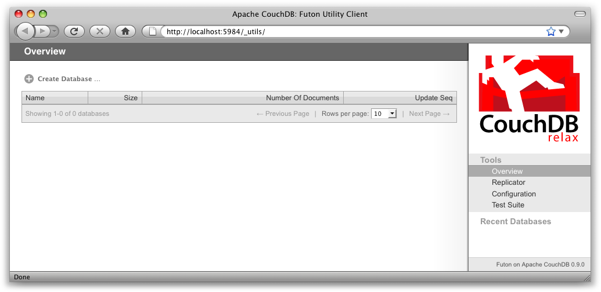
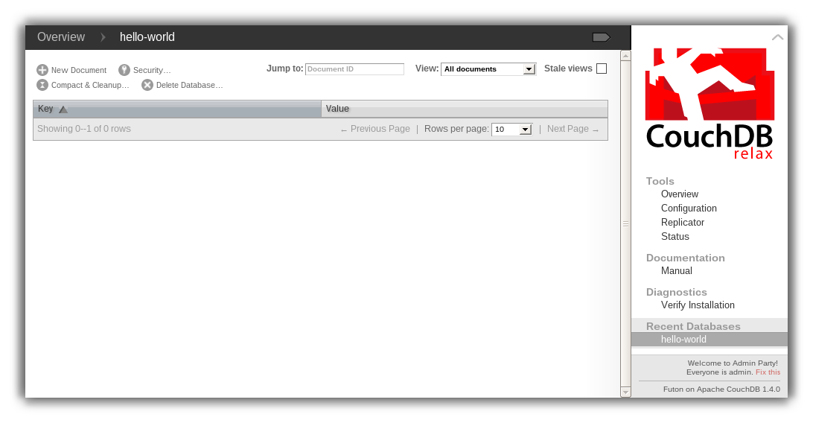
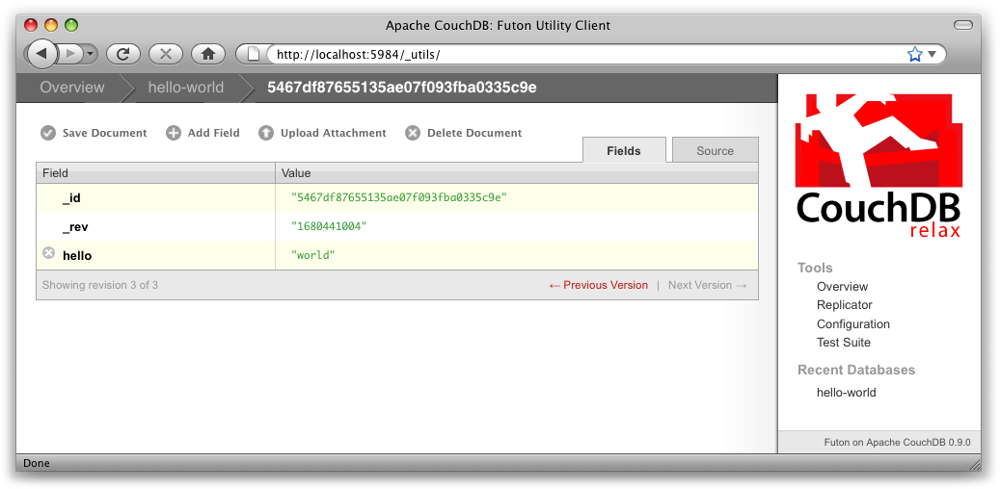
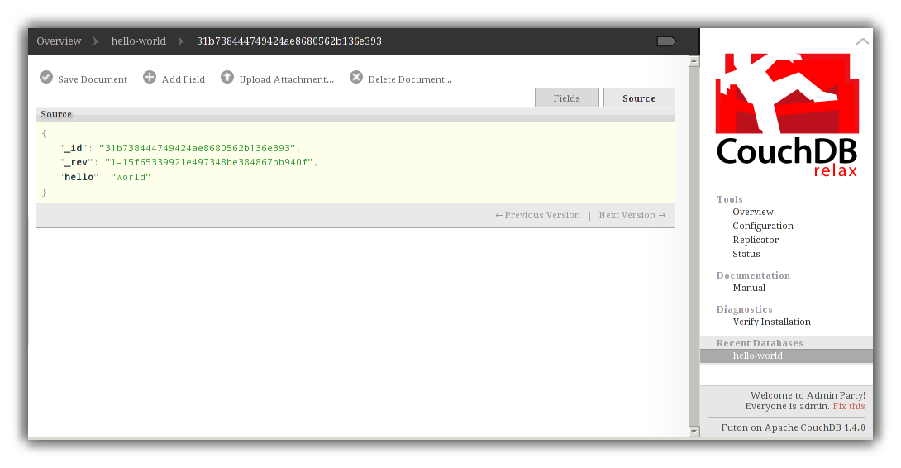
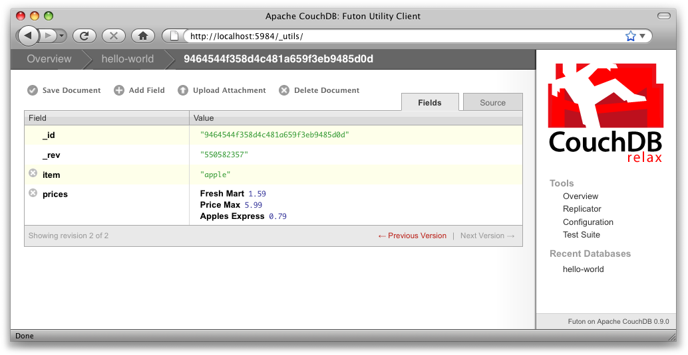
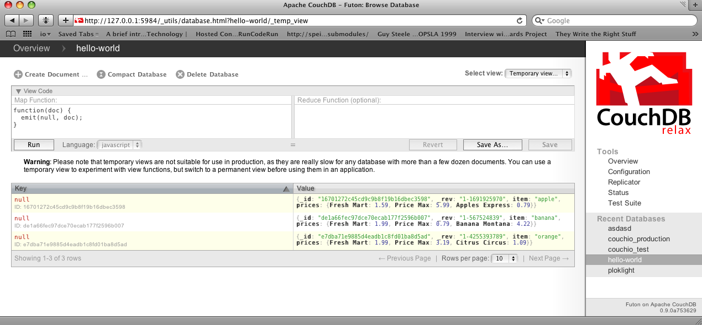
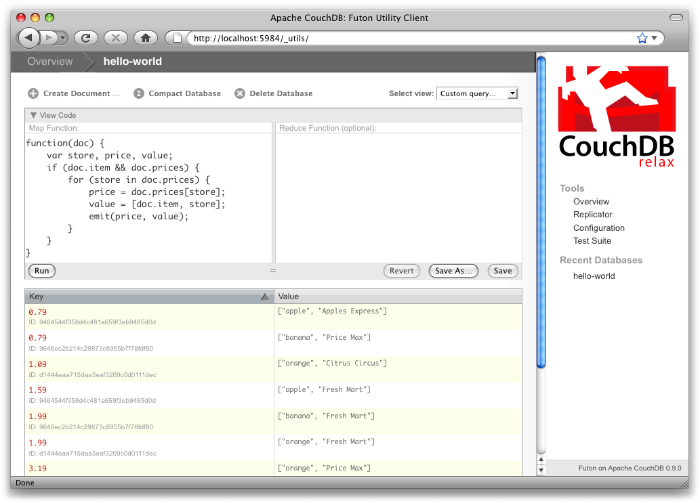
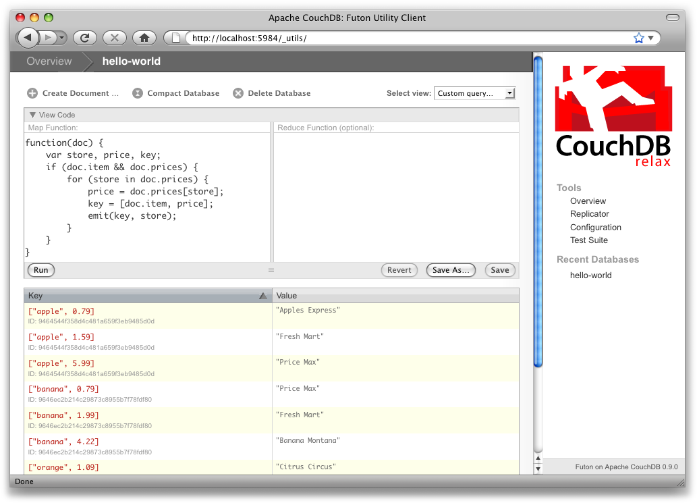
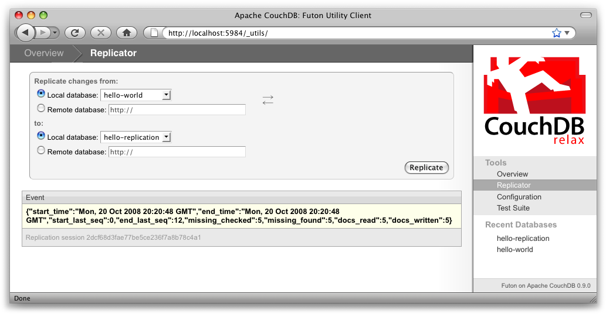

.. Licensed under the Apache License, Version 2.0 (the "License"); you may not
.. use this file except in compliance with the License. You may obtain a copy of
.. the License at
..
..   http://www.apache.org/licenses/LICENSE-2.0
..
.. Unless required by applicable law or agreed to in writing, software
.. distributed under the License is distributed on an "AS IS" BASIS, WITHOUT
.. WARRANTIES OR CONDITIONS OF ANY KIND, either express or implied. See the
.. License for the specific language governing permissions and limitations under
.. the License.

.. _intro/tour:

===============
Getting Started
===============

In this document, we'll take a quick tour of CouchDB's features,
familiarizing ourselves with Futon, the built-in administration interface.
We'll create our first document and experiment with CouchDB views.

All Systems Are Go!
===================

We'll have a very quick look at CouchDB's bare-bones Application Programming
Interface (API) by using the command-line utility curl. Please note that this
is not the only way of talking to CouchDB. We will show you plenty more
throughout the rest of the documents. What's interesting about curl is that it
gives you control over raw HTTP requests, and you can see exactly what is
going on "underneath the hood" of your database.

Make sure CouchDB is still running, and then do::

  curl http://127.0.0.1:5984/

This issues a GET request to your newly installed CouchDB instance.

The reply should look something like:

.. code-block:: javascript

  {
    "couchdb": "Welcome",
    "uuid": "85fb71bf700c17267fef77535820e371",
    "version": "1.4.0",
    "vendor": {
        "version": "1.4.0",
        "name": "The Apache Software Foundation"
    }
  }

Not all that spectacular. CouchDB is saying "hello" with the running version
number.

Next, we can get a list of databases::

  curl -X GET http://127.0.0.1:5984/_all_dbs

All we added to the previous request is the _all_dbs string.

The response should look like::

  ["_replicator","_users"]

Oh, that's right, we didn't create any databases yet! All we see is an empty
list.

.. note::

  The curl command issues GET requests by default. You can issue POST requests
  using ``curl -X POST``. To make it easy to work with our terminal history,
  we usually use the ``-X`` option even when issuing GET requests.
  If we want to send a POST next time, all we have to change is the method.

  HTTP does a bit more under the hood than you can see in the examples here.
  If you're interested in every last detail that goes over the wire,
  pass in the ``-v`` option (e.g., ``curl -vX GET``), which will show you
  the server curl tries to connect to, the request headers it sends,
  and response headers it receives back. Great for debugging!

Let's create a database::

  curl -X PUT http://127.0.0.1:5984/baseball

CouchDB will reply with::

  {"ok":true}

Retrieving the list of databases again shows some useful results this time::

  curl -X GET http://127.0.0.1:5984/_all_dbs

::

  ["baseball"]

.. note::

  We should mention JavaScript Object Notation (JSON) here,
  the data format CouchDB speaks. JSON is a lightweight data interchange format
  based on JavaScript syntax. Because JSON is natively compatible with
  JavaScript, your web browser is an ideal client for CouchDB.

  Brackets (``[]``) represent ordered lists, and curly braces (``{}``) represent
  key/value dictionaries. Keys must be strings, delimited by quotes (``"``),
  and values can be strings, numbers, booleans, lists,
  or key/value dictionaries. For a more detailed description of JSON,
  see Appendix E, JSON Primer.

Let's create another database::

  curl -X PUT http://127.0.0.1:5984/baseball

CouchDB will reply with::

  {"error":"file_exists","reason":"The database could not be created,
  the file already exists."}

We already have a database with that name, so CouchDB will respond with an
error. Let's try again with a different database name::

  curl -X PUT http://127.0.0.1:5984/plankton

CouchDB will reply with::

  {"ok":true}

Retrieving the list of databases yet again shows some useful results::

  curl -X GET http://127.0.0.1:5984/_all_dbs

CouchDB will respond with::

  ["baseball", "plankton"]

To round things off, let's delete the second database::

  curl -X DELETE http://127.0.0.1:5984/plankton

CouchDB will reply with::

  {"ok":true}

The list of databases is now the same as it was before::

  curl -X GET http://127.0.0.1:5984/_all_dbs

CouchDB will respond with::

  ["baseball"]

For brevity, we'll skip working with documents, as the next section covers a
different and potentially easier way of working with CouchDB that should
provide experience with this. As we work through the example,
keep in mind that "under the hood" everything is being done by the
application exactly as you have been doing here manually.
Everything is done using GET, PUT, POST, and DELETE with a URI.

Welcome to Futon
================

After having seen CouchDB's raw API, let's get our feet wet by playing with
Futon, the built-in administration interface. Futon provides full access to
all of CouchDB's features and makes it easy to work with some of the more
complex ideas involved. With Futon we can create and destroy databases; view
and edit documents; compose and run MapReduce views; and trigger replication
between databases.

To load Futon in your browser, visit::

  http://127.0.0.1:5984/_utils/

If you're running version 0.9 or later, you should see something similar to
:ref:`intro/tour-01`. In later documents, we'll focus on using CouchDB from
server-side languages such as Ruby and Python. As such, this document is a great
opportunity to showcase an example of natively serving up a dynamic web
application using nothing more than CouchDB's integrated web server, something
you may wish to do with your own applications.

The first thing we should do with a fresh installation of CouchDB is run the
test suite to verify that everything is working properly. This assures us
that any problems we may run into aren't due to bothersome issues with our
setup. By the same token, failures in the Futon test suite are a red flag,
telling us to double-check our installation before attempting to use a
potentially broken database server, saving us the confusion when nothing
seems to be working quite like we expect!

.. _intro/tour-01:

   Figure 1. The Futon welcome screen

Some common network configurations cause the replication test to fail when
accessed via the localhost address. You can fix this by accessing CouchDB via
127.0.0.1, e.g. http://127.0.0.1:5984/_utils/.

Your First Database and Document
================================

Creating a database in Futon is simple. From the overview page,
click "Create Database." When asked for a name, enter hello-world and click
the Create button.

After your database has been created, Futon will display a list of all its
documents. This list will start out empty (:ref:`intro/tour-03`), so let's
create our first document. Click the "New Document" link and then the Create
button in the pop up. Make sure to leave the document ID blank,
and CouchDB will generate a UUID for you.

For demoing purposes, having CouchDB assign a UUID is fine. When you write
your first programs, we recommend assigning your own UUIDs. If your rely on
the server to generate the UUID and you end up making two POST requests
because the first POST request bombed out, you might generate two docs and
never find out about the first one because only the second one will be
reported back. Generating your own UUIDs makes sure that you'll never end up
with duplicate documents.

Futon will display the newly created document, with its _id and _rev as the
only fields. To create a new field, click the "Add Field" button. We'll call
the new field hello. Click the green check icon (or hit the Enter key) to
finalize creating the hello field. Double-click the hello field's value
(default null) to edit it.

You can experiment with other JSON values; e.g., ``[1, 2, "c"]`` or
``{"foo": "bar"}``. Once you've entered your values into the document,
make a note of its ``_rev`` attribute and click "Save Document." The result
should look like :ref:`intro/tour-04`.

.. _intro/tour-03:

   Figure 3. An empty database in Futon

.. _intro/tour-04:

   Figure 4. A "hello world" document in Futon

You'll notice that the document's _rev has changed. We'll go into more detail
about this in later documents, but for now, the important thing to note is
that _rev acts like a safety feature when saving a document. As long as you
and CouchDB agree on the most recent _rev of a document, you can successfully 
save your changes.

Futon also provides a way to display the underlying JSON data,
which can be more compact and easier to read, depending on what sort of data
you are dealing with. To see the JSON version of our "hello world" document,
click the Source tab. The result should look like :ref:`intro/tour-05`.

.. _intro/tour-05:

   Figure 5. The JSON source of a "hello world" document in Futon

Running a Query Using MapReduce
===============================

Traditional relational databases allow you to run any queries you like as
long as your data is structured correctly. In contrast,
CouchDB uses predefined map and reduce functions in a style known as
MapReduce. These functions provide great flexibility because they can adapt
to variations in document structure, and indexes for each document can be
computed independently and in parallel. The combination of a map and a reduce
function is called a view in CouchDB terminology.

For experienced relational database programmers, MapReduce can take some
getting used to. Rather than declaring which rows from which tables to
include in a result set and depending on the database to determine the most
efficient way to run the query, reduce queries are based on simple range
requests against the indexes generated by your map functions.

Map functions are called once with each document as the argument.
The function can choose to skip the document altogether or emit one or more
view rows as key/value pairs. Map functions may not depend on any information
outside of the document. This independence is what allows CouchDB views to be
generated incrementally and in parallel.

CouchDB views are stored as rows that are kept sorted by key. This makes
retrieving data from a range of keys efficient even when there are thousands
or millions of rows. When writing CouchDB map functions,
your primary goal is to build an index that stores related data under nearby
keys.

Before we can run an example MapReduce view, we'll need some data to run it
on. We'll create documents carrying the price of various supermarket items as
found at different shops. Let's create documents for apples, oranges,
and bananas. (Allow CouchDB to generate the _id and _rev fields.) Use Futon
to create documents that have a final JSON structure that looks like this:

.. code-block:: javascript

  {
   "_id": "00a271787f89c0ef2e10e88a0c0001f4",
   "_rev": "1-2628a75ac8c3abfffc8f6e30c9949fd6",
   "item": "apple",
   "prices": {
       "Fresh Mart": 1.59,
       "Price Max": 5.99,
       "Apples Express": 0.79
   }
  }

This document should look like :ref:`intro/tour-06` when entered into Futon.

.. _intro/tour-06:

   Figure 6. An example document with apple prices in Futon

OK, now that that's done, let's create the document for oranges:

.. code-block:: javascript

  {
   "_id": "00a271787f89c0ef2e10e88a0c0003f0",
   "_rev": "1-e9680c5d9a688b4ff8dd68549e8e072c",
   "item": "orange",
   "prices": {
       "Fresh Mart": 1.99,
       "Price Max": 3.19,
       "Citrus Circus": 1.09
   }
  }

And finally, the document for bananas:

.. code-block:: javascript

  {
   "_id": "00a271787f89c0ef2e10e88a0c00048b",
   "_rev": "1-60e25d93dc12884676d037400a6fa189",
   "item": "banana",
   "prices": {
       "Fresh Mart": 1.99,
       "Price Max": 0.79,
       "Banana Montana": 4.22
   }
  }

Imagine we're catering a big luncheon, but the client is very price-sensitive.
To find the lowest prices, we're going to create our first view,
which shows each fruit sorted by price. Click "hello-world" to return to the
hello-world overview, and then from the "select view" menu choose "Temporary
view…" to create a new view.

   Figure 7. A temporary view in Futon

Edit the map function, on the left, so that it looks like the following:

.. code-block:: javascript

  function(doc) {
    var shop, price, value;
    if (doc.item && doc.prices) {
        for (shop in doc.prices) {
            price = doc.prices[shop];
            value = [doc.item, shop];
            emit(price, value);
        }
    }
  }

This is a JavaScript function that CouchDB runs for each of our documents as
it computes the view. We'll leave the reduce function blank for the time being.

Click "Run" and you should see result rows like in :ref:`intro/tour-08`,
with the various items sorted by price. This map function could be even more
useful if it grouped the items by type so that all the prices for bananas were
next to each other in the result set. CouchDB's key sorting system allows any
valid JSON object as a key. In this case, we'll emit an array of [item, price]
so that CouchDB groups by item type and price.

.. _intro/tour-08:

   Figure 8. The results of running a view in Futon

Let's modify the view function so that it looks like this:

.. code-block:: javascript

  function(doc) {
    var shop, price, key;
    if (doc.item && doc.prices) {
        for (shop in doc.prices) {
            price = doc.prices[shop];
            key = [doc.item, price];
            emit(key, shop);
        }
    }
  }

Here, we first check that the document has the fields we want to use. CouchDB
recovers gracefully from a few isolated map function failures,
but when a map function fails regularly (due to a missing required field or
other JavaScript exception), CouchDB shuts off its indexing to prevent any
further resource usage. For this reason, it's important to check for the
existence of any fields before you use them. In this case,
our map function will skip the first "hello world" document we created
without emitting any rows or encountering any errors. The result of this
query should look like :ref:`intro/tour-09`.

.. _intro/tour-09:

   Figure 9. The results of running a view after grouping by item type and price

Once we know we've got a document with an item type and some prices,
we iterate over the item's prices and emit key/values pairs. The key is an
array of the item and the price, and forms the basis for CouchDB's sorted
index. In this case, the value is the name of the shop where the item can be
found for the listed price.

View rows are sorted by their keys -- in this example, first by item,
then by price. This method of complex sorting is at the heart of creating
useful indexes with CouchDB.

MapReduce can be challenging, especially if you've spent years working with
relational databases. The important things to keep in mind are that map
functions give you an opportunity to sort your data using any key you choose,
and that CouchDB's design is focused on providing fast,
efficient access to data within a range of keys.

Triggering Replication
======================

Futon can trigger replication between two local databases,
between a local and remote database, or even between two remote databases.
We'll show you how to replicate data from one local database to another,
which is a simple way of making backups of your databases as we're working
through the examples.

First we'll need to create an empty database to be the target of replication.
Return to the overview and create a database called hello-replication.
Now click "Replicator" in the sidebar and choose hello-world as the source
and hello-replication as the target. Click "Replicate" to replicate your
database. The result should look something like :ref:`intro/tour-10`.

.. _intro/tour-10:

   Figure 10. Running database replication in Futon

.. note::

  For larger databases, replication can take much longer. It is important to
  leave the browser window open while replication is taking place.
  As an alternative, you can trigger replication via curl or some other HTTP
  client that can handle long-running connections. If your client closes the
  connection before replication finishes, you'll have to retrigger it.
  Luckily, CouchDB's replication can take over from where it left off
  instead of starting from scratch.

Wrapping Up
===========

Now that you've seen most of Futon's features, you'll be prepared to dive in
and inspect your data as we build our example application in the next few
documents. Futon's pure JavaScript approach to managing CouchDB shows how it's
possible to build a fully featured web application using only CouchDB's HTTP
API and integrated web server.

But before we get there, we'll have another look at CouchDB's HTTP API -- now
with a magnifying glass. Let's curl up on the couch and relax.
