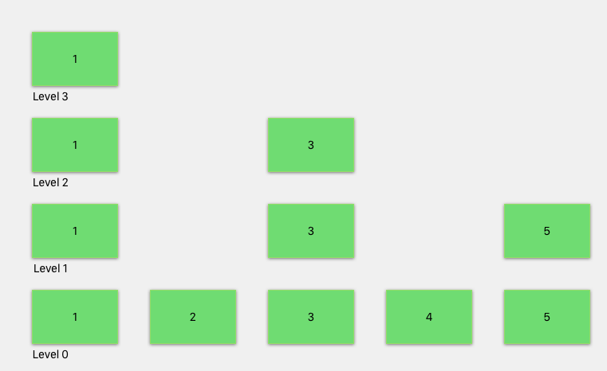

## Introduction

This document describes 3 possible ways to support CouchDB's reduce functionality on top of FoundationDB.
The main focus will be on a Skip List algorithm as it has the most potential to support all the required functionality.

## Abstract

Reduce indexes allow users of CouchDB to perform aggregations on a map index. These aggregations need to be stored in FoundationDB in a way that is efficient for updating the index on document updates and when retrieving results for different reduce group levels.
Three options are initially listed, with a skip list approach selected as the most viable option. A process flow for building, retrieving and updating a skip list based reduce index is described. Finally, the data model for using this with FoundationDB is shown.

## Requirements Language

The key words "MUST", "MUST NOT", "REQUIRED", "SHALL", "SHALL NOT",
"SHOULD", "SHOULD NOT", "RECOMMENDED",  "MAY", and "OPTIONAL" in this
document are to be interpreted as described in
[RFC 2119](https://www.rfc-editor.org/rfc/rfc2119.txt).

## Terminology

No new terminology at this point.

---

## Detailed Description

Reduce indexes allow users of CouchDB to perform aggregations based on the key/values emitted from the map function.
A lot of the power of the reduce functionality that CouchDB currently supports is because internally each map/reduce index is stored in a b+tree with non-leaf nodes containing aggregations of the results from their children. Allowing for efficient retrieval of those values. It is difficult to replicate that behavior exactly using FoundationDB. Therefore to implement reduce indexes in FoundationDB three possible ways are considered.

### Option 1 - On the fly reduce calculation

The simplest implementation is to perform the reduce function on the fly when a reduce query is requested.
The map index will be read and the reduce aggregation performed on the keys as they are fetched from FoundationDB.
This is by far the easiest to implement, but query performance will degrade as the database and index grows and could reach a point where the reduce query just stops working.

### Option 2 - Precompute of all group-levels

Another option is to precompute all group level's for a reduce function and store them as key/values in FoundationDB.
This makes querying fast as the results are already calculated. The first difficulty comes when updating the index.
For the built-in `_sum` and `_count` reduce functions, a single reduce calculation can be run and then applied to all group levels.
For any custom reduce functions along with  `_stats` (`min` and `max` specifically) and `_approx_count_distinct`, the updating of each group level would be more complex as it requires reading all keys and running them through the reduce functions for all group levels before storing it back in FoundationDB.

Another issue is any queries using startkey/endkey can be an expensive operation as we would have to perform aggregations on the startkey and the endkey key ranges. Then `group_level = 0` queries with a startkey or endkey would require a full aggregation of the keys in that range which again could be an expensive operation.

### Option 3 - Skip list implementation

The final option is using a skip list. A skip list can be thought of as a layered linked list. The bottom layer contains all the elements in an index. Each layer up from that is has a reduced (pun intended) number of elements in that list. See figure 1 for a simple skip list layout.


*Figure 1:* Example of a skip list

A skip list would make it easier to query an index using startkey/endkey and more efficient than option 2 to update an index for all types of reduce functions.

### Skip list implementation

This section does a deep dive into how a skip list can be used to create, query and update a reduce index.
To explore these situations, we will have the following design document defined.

```js
    {
        "_id": "_design/reduce-example"
        "views: {
            "example": {
                "map": function (doc) {
                    emit([doc.year, doc.month, doc.day], 1);
                },

                "reduce": "_count"
            }
        }
    }

```

And it emits the following key/value results for the reduce function:

```js
    [2017, 03, 1] = 1
    [2017, 04, 1] = 1
    [2017, 04, 1] = 1
    [2017, 04, 15] = 1
    [2017, 05, 1] = 1

    [2018, 03, 1] = 1
    [2018, 04, 1] = 1
    [2018, 05, 1] = 1

    [2019, 03, 1] = 1
    [2018, 04, 1] = 1
    [2018, 05, 1] = 1
```

#### Create

To build the skip list, all keys will be added to level 0. When multiple of the same keys are emitted, the values are re-reduced before being added so level 0. Then each level up, a reduced number of keys will be added. For each level above 0, if a key/value is not added to that level, then that key's value is aggregated with the previous node in that row. Therefore each key/value node in a level is an aggregation of its key/value in level 0 and any key/values from the previous level that are greater than the node and smaller than the next node on that level.

See figure 2 for an example of the listed keys added to a skip list.


*figure 2:* The emitted reduce keys added to a reduce skip list

##### Skip levels and Level Distribution

The number of skip list levels will be made configurable and the best level will be determined via performance testing.
The algorithm to distribute keys across levels will be

```js
const MAX_LEVELS = 6;
const LEVEL_FAN_POW = 4; // 2^X per level or (1 / 2^X) less than previous level

const hashCalc = (key, level) => {
    const keyHash = hashCode(JSON.stringify(key));
    const out = (keyHash & ((1 << (level * LEVEL_FAN_POW)) - 1));
    if (out !== 0) {
        return false;
    }

    return true;
}
```

The `hashCode` will hash the key to an integer. This allows for a consistent and predictable distribution across levels.
The `LEVEL_FAN_POW` will also be configurable.h

#### Query

From the above figure 2, we can see that for a reduce query with `group = true` then level 0 will be used to return all the exact keys.
And for a query with `group_level = 0` then the highest level can be used. 
If a `group_level > 1` is set for a reduce query, we need to traverse the skip list and aggregate the results before returning the results to the user.

For example, using figure 2, with a reduce query of `group_level = 2`. We start at Level 4, we would traverse down to level 3, compare Node 0 and Node [2018, 03, 1]. They are not the same key for `group_level = 2` so we need to move to a lower level. We would perform the same action of comparing the current node with the next node to see if they are the same key until we find matching nodes or we get to level 0. In this case, we would reach level 0 and return Node [2017, 03, 1]. At Node [2017, 04, 1] it is possible to go back up to level 2 where we can compare [2017, 04, 1] and [2017, 04, 15]. Given they are the same, we can continue on level 1 and collect all the [2017, 04, x] keys. Once we have collected all of those. Those keys are run through a re-reduce before being returned. This process of comparing the current node with the next node would continue onwards. Each time comparing the current node with the next node. If they are the same, compare the Nodes at the next Level above until we reach a level where the keys are not equal. At that point, we would use the node values at the level just below that to move across, collecting all the equal keys to be run through a reducer before being returned.


*Figure 3:* Traversing flow to return results for `group_level = 2`

A query with startkey/endkey would follow a similar process.  Start at the highest level traversing across until we exceed the startkey, then move down until we find the startkey or nearest node to it. Then follow the above process of traversing the skip list to return all results until we reach a node that is greater or equal to the endkey.

#### Update

To update the reduce index, we will use the same map id index that keeps track of what keys are associated with a document. When a document is deleted, the previous keys will be removed from level 0. If the reduce function is `_sum` or `_count`, an atomic update is then performed for all Node's above Level 0 that would have included the values for the keys deleted.  

For reduce functions where we cannot perform an atomic update. The process for each level, above level 0, is to fetch all the key/values in the level below the current node that are used to calculate the current node's aggregation value. Re-reduce those keys to calculate the new value stored for the node and store those results back in FoundationDB.

When updating a document, the initial delete process is followed to remove the existing keys that are no longer emitted for this document. The new keys are added at level 0. For levels above 0, the same distribution algorithm will be used to determine if the key/values are added to a level. If they are, then an aggregation of the nodes after this node but at the level below is performed to calculate the aggregation value stored for this node. The previous node's value is also recalculated. This continues up to the max level on the skip list. For `_sum` and `_count` this can be done as an atomic update. For other reduce functions this will be a re-reduce. If the new key/value is not added to the level, the value is aggregated with a node smaller than the key in that level.

In the situation where multiple documents emit the same key, those keys are re-reduced before being added into fdb.

### Data model

The data model for the skip list implementation is below. The value will contain the reduce value, along with the unencoded key that would be returned for a query.

```erlang
{<database>, ?DB_VIEWS, Sig, ?VIEW_REDUCE_SK_RANGE, ViewId, SkipLevel, ReduceKey} = {UnEncodedKey, Value}

SkipLevel = 0..?MAX_SKIP_LEVEL

```

Each field is defined as:

- `<database>` is the specific database namespace
- `?DB_VIEWS` is views namespace.
- `Sig` is the design documents View Signature
- `?VIEW_REDUCE_SK_RANGE` is the reduce namespace
- `ViewId` id of a view defined in the design document
- `SkipLevel` is the skip level the key/value is being stored for
- `ReduceKey` is the encoded emitted keys
- `RowType` indicates if the row is storing the emitted key or emitted value
- `UnEncodedKey` the unencoded emitted keys
- `Value` the reduce value for the emitted keys

## FoundationDB Skip list implementation

In Appendix A, is a full 

## Advantages and Disadvantages

- Skip Lists can be used for builtin reduces and custom reduces.

## Disadvantages

- Because the levels are randomly generated and values aggregated, there will be an increased number of traversals of lower levels compared to using a B+tree.

## Key Changes

Instead of using a B+tree to store reduce aggregations, CouchDB's reduce functionality will be built on top of FoundationDB using a skip list like algorithm.

## Applications and Modules affected

The module `couch_views` will be modified to support building and querying reduce indexes.

## HTTP API additions

There won't be any additions to the HTTP API.

## HTTP API deprecations

There are no HTTP API deprecations

## Security Considerations

None have been identified.

## References

[Wikipedia Skip List](https://en.wikipedia.org/wiki/Skip_list)
[Skip lists done right](http://ticki.github.io/blog/skip-lists-done-right/)
[FoundationDB Forum skip list suggestion](https://forums.foundationdb.org/t/couchdb-considering-rearchitecting-as-an-fdb-layer/1088/11)
[Initial mailing list discussion](https://lists.apache.org/thread.html/011caa9244b3378e7e137ea7b0f726d8e6a17009df738a81636cb273@%3Cdev.couchdb.apache.org%3E)

## Acknowledgements

Thanks to
  @rnewson
  @alexmiller-apple
  @kocolosk

  for reviewing the RFC and mailing list discussion


## Appendix A

Below is a javascript implementation of a FoundationDB skip list implementation. It can also be found in a [github repo](https://github.com/garrensmith/fdb-skiplist-reduce) for quicker cloning and testing. This implementation makes some assumptions:

1. All keys are arrays of [Year, Month, Day]
2. Only implements startkey/endkey
3. No delete was implemented
4. This is a basic implementation to make sure we get creating/updating and traversal correct. It does not cover edge cases or much error handling

Some results that I determined while running this:

1. Time to insert a key stayed the same even as the skiplist grew
1. For smaller reduce indexes (under a million rows), it was better to have a lower `LEVEL_FAN_POW`. Otherwise, the majority of keys remained on level 0 and level 1, so querying could not make much use of the higher levels. However, insertions are then slightly slower.

```js
/* To run locally
    npm install foundationdb
    node skiplist.js
*/


const assert = require('assert');
const util = require('util');
const fdb = require('foundationdb');
const ks = require('foundationdb').keySelector;

// CONSTANTS
const SHOULD_LOG = false;
const PREFIX = 'skiplist';
const MAX_LEVELS = 6;
const LEVEL_FAN_POW = 1; // 2^X per level or (1 / 2^X) less than previous level
const END = 0xFF;

fdb.setAPIVersion(600); // Must be called before database is opened
const db = fdb.openSync()
  .at(PREFIX) // database prefix for all operations
  .withKeyEncoding(fdb.encoders.tuple)
  .withValueEncoding(fdb.encoders.json); // automatically encode & decode values using JSON

// Data model
// (level, key) = reduce_value


const log = (...args) => {
    if (!SHOULD_LOG) {
        return;
    }
    console.log(...args);
}

// keep a basic stats of which levels were used for a query
let stats;
const resetStats = () => {
    stats = {
        "0": [],
        "1": [],
        "2": [],
        "3": [],
        "4": [],
        "5": [],
        "6": [],
    };
}

// An initial simple set of kvs to insert and query to verify the algoritym
const kvs = [
    [[2017,3,1], 9],
    [[2017,4,1], 7], 
    [[2019,3,1], 4], // out of order check
    [[2017,4,15], 6],
    [[2018,4,1], 3],  
    [[2017,5,1], 9],
    [[2018,3,1], 6],
    [[2018,4,1], 4], // duplicate check
    [[2018,5,1], 7],
    [[2019,4,1], 6],
    [[2019,5,1], 7]
  ];

// UTILS

const getRandom = (min, max) => {
    min = Math.ceil(min);
    max = Math.floor(max);
    return Math.floor(Math.random() * (max - min)) + min; //The maximum is exclusive and the minimum is inclusive
  }

const getRandomKey = (min, max) => {
    return [getRandom(min, max), getRandom(1, 12), getRandom(1, 30)];
}

// Very rough hash algorithm to convert any string to an integer
function hashCode(s) {
    for(var i = 0, h = 0; i < s.length; i++)
        h = Math.imul(31, h) + s.charCodeAt(i) | 0;
    return h;
}

// calculation to determine if key should be added to a level
const hashCalc = (key, level, pow) => {
    const keyHash = hashCode(JSON.stringify(key));
    const out = (keyHash & ((1 << (level * pow)) - 1));
    if (out !== 0) {
        return false;
    }

    return true;
}

// Basic rereduce function
// _sum but pretend its more complex
const rereduce = (values) => {
    return values.reduce((acc, val) => {
        return acc + val;
    }, 0);
};

// Takes all key/values and collates to group level and runs rereduce
const collateRereduce = (acc, groupLevel) => {
    const acc1 = acc.reduce((acc, kv) => {
        const key = getGroupLevelKey(kv.key, groupLevel);

        if (!acc[key]) {
            acc[key] = {
                key,
                values: []
            };
        }

        acc[key].values.push(kv.value);
        return acc;
    }, {});

    return Object.values(acc1).reduce((acc, kv) => {
        const values = kv.values;
        const key = kv.key;
        const result = rereduce(values);

        acc.push({
            key,
            value: result
        });

        return acc;
    }, []);
};

// KEY UTIL FUNCTIONS

// convert key to binary
const keyToBinary = (one) => {
    let keyOne = one.key ? one.key : one;

    if (!Array.isArray(keyOne)) {
        keyOne = [keyOne];
    }


    return Buffer.from(keyOne);
}

// check keys are equal
const keysEqual = (one, two) => {
    if (one === null || two === null) {
        return false;
    }

    const binOne = keyToBinary(one);
    const binTwo = keyToBinary(two);

    return binOne.compare(binTwo) === 0;
}

// Are keys equal at set group level
const groupLevelEqual = (one, two, groupLevel) => {
    if (one === null || two === null) {
        return false
    }
    const levelOne = getGroupLevelKey(one.key, groupLevel);
    const levelTwo = getGroupLevelKey(two.key, groupLevel);

    return keysEqual(levelOne, levelTwo);
};

// is key two greater than key one?
const keyGreater = (one, two) => {
    if (!one || !two) {
        return false;
    }

    const binOne = keyToBinary(one);
    const binTwo = keyToBinary(two);

    // key two comes after
    return binOne.compare(binTwo) === -1;
}

// convert key to group level. e.g Key = [2019,2,5] and group_level = 2
// returns [2019, 2]
const getGroupLevelKey = (key, groupLevel) => {
    if (groupLevel === 0) {
        return null
    }

    if (!Array.isArray(key)) {
        return key;
    }

    if (key.length <= groupLevel) {
        return key;
    }

    return key.slice(0, groupLevel);
};

// FDB OPERATIONS

// clear full range
const clear = async () => {
    await db.doTransaction(async tn => {
        tn.clearRangeStartsWith([]);
    });
}

// get value for key at level
const getVal = async (tn, key, level) => {
    return  await tn.get([level, key]);
}

// add kv to level
const insertAtLevel = async (tn, key, value, level) => {
    log('inserting', level, key, ':', value);
    return await tn.set([level, key], value);
};

// get all kvs within start/end, exclusive of end key
const getRange = async (tn, start, end, level) => {
    const kvs = await tn.getRangeAll([level, start], [level, end]);

    return kvs.map(([[_level, key], value]) => {
        return {
            key,
            value
        };
    });
};

// get all kvs within start/end, inclusive of end
const getRangeInclusive = async (tn, start, end, level) => {
    const kvs = await tn.getRangeAll(
        ks.firstGreaterOrEqual([level, start]), 
        ks.firstGreaterThan([level, end])
        );

    return kvs.map(([[_level, key], value]) => {
        return {
            key,
            value
        };
    });
}

// return kv in common format
const getKV = (item) => {
    const [key, value] = item.value;
    return {
        key: key[1],
        value: value
    };
}

// Get key after supplied key
const getNext = async (tn, key, level) => {
    const iter = await tn.snapshot().getRange(
        ks.firstGreaterThan([level, key]),
        [level, END],
        {limit: 1}
    )

    const item = await iter.next();
    if (item.done) {
        return {
            key: END,
            value: 0
        };
    }

    const kv = getKV(item);
    tn.addReadConflictKey([level, kv.key]);
    return kv;
};

// Get key after supplied key but doesn't look further than endkey
const getKeyAfter = async (tn, key, level, endkey) => {
    const _endkey = endkey ? endkey : END;
    const iter = await tn.getRange(
        ks.firstGreaterThan([level, key]),
        ks.firstGreaterThan([level, _endkey]),
        {limit: 1}
    )
    
    const item = await iter.next();
    if (item.done) {
        return null;
    }

    return getKV(item);
};

// get kv before supplied key
const getPrevious = async (tn, key, level) => {
    const iter = await tn.snapshot().getRange(
        ks.lastLessThan([level, key]),
        ks.firstGreaterOrEqual([level, key]),
        {limit: 1}
    )

    const item = await iter.next();
    const kv = getKV(item);
    tn.addReadConflictKey([level, kv.key]);
    return kv;
};

// Get key at level or first one after key
const getKeyOrNearest = async (tn, key, level, endkey) => {
    const _endkey = endkey ? endkey : END;
    const iter = await tn.getRange(
        ks.firstGreaterOrEqual([level, key]),
        ks.firstGreaterThan([level, _endkey]),
        {limit: 1}
    )
    
    const item = await iter.next();
    if (item.done) {
        return null;
    }

    return getKV(item);
};

// Gets the final key in the set group level
const getGroupLevelEndKey = async (tn, groupLevel, level, startkey) => {
    const groupLevelKey = getGroupLevelKey(startkey, groupLevel);
    const end = groupLevelKey === null ? END : [...groupLevelKey, END];
    const iter = await tn.getRange(
        ks.firstGreaterThan([level, groupLevelKey]),
        ks.firstGreaterOrEqual([level, end]),
        {reverse: true, limit: 1}
    )
    
    //TODO: add a conflict key
    const item = await iter.next();
    if (item.done) {
        return null;
    }

    return getKV(item);
};

// Returns key for level or the first one before it
const getKeyOrFirstBefore = async (tn, key, level) => {
    const iter = await tn.getRange(
        ks.lastLessThan([level, key]),
        ks.firstGreaterThan([level, key]),
        {limit: 1, reverse: true}
    )
    
    //TODO: add a conflict key
    const item = await iter.next();
    if (item.done) {
        return null;
    }

    return getKV(item);
};

// SKIP LIST OPERATIONS

//setup skip list and insert the initial kvs
const create = async () => {
    await db.doTransaction(async tn => {
        for(let level = 0; level <= MAX_LEVELS; level++) {
            await insertAtLevel(tn, '0', 0, level);
        }
    });

    log('setup done');
    for ([key, val] of kvs) {
        await db.doTransaction(async tn => {
            await insert(tn, key, val);
        });
    }
};

// inserts a larger amount of keys, 1000 keys per transaction
const rawKeys = []
const createLots = async () => {
    const docsPerTx = 3000;
    console.time('total insert');
    for (let i = 0; i <= 30000; i+= docsPerTx) {
        const kvs = [];
        for (let k = 0; k <= docsPerTx; k++) {
            const key = getRandomKey(2015, 2020);
            const value = getRandom(1, 20);
            rawKeys.push({key, value});
            kvs.push([key, value]);
        }
        console.time('tx');
        await db.doTransaction(async tn => {
            for ([key, value] of kvs) {
                await insert(tn, key, value);
            }
        });
        console.timeEnd('tx');
        log('inserted ${i} keys');
    }
    console.timeEnd('total insert');
}

/* The insert algorithm
 Works as follows:
 Level 0:
 * Always insert,
 * if key already exists at level 0, then rereduce two values and insert
 At level's > 0
 * Get previous kv at level
 * If hashCalc is true, key should be inserted at level
 * So need to recalculate previous keys value,
 * Get range from level below from previous key to current key
 * Rereduce those kvs and update previous key's value
 * Then get next key after current key at level
 * Use that to get range from current key to next key at level below
 * Rereduce those values to create value for current key
 
 * If hashCalc is false, key is not inserted at level
 * So rereduce previous key's value with current key's value and update previous kv
*/
const insert = async (tn, key, value) => {
    let currentVal = value; // if this k/v has been stored before we need to update this value at level 0 to be used through the other levels
    for(let level = 0; level <= MAX_LEVELS; level++) {
        if (level === 0) {
            const existing = await getVal(tn, key, level);
            if (existing) {
                currentVal = rereduce([existing, currentVal]);
            }
            await insertAtLevel(tn, key, currentVal, 0);
            continue;
        }
        const previous = await getPrevious(tn, key, level);
        log('Planning to insert at ', level, 'key', key, 'previous is', previous);
        if (hashCalc(key, level, LEVEL_FAN_POW)) {
            const lowerLevel = level - 1;
            // update previous node
            const newPrevRange = await getRange(tn, previous.key, key, lowerLevel);
            log('prevRange', newPrevRange, 'prevKey', previous, 'key', key);
            const prevValues = newPrevRange.map(kv => kv.value);
            const newPrevValue = rereduce(prevValues)
            if (newPrevValue !== previous.value) {
                await insertAtLevel(tn, previous.key, newPrevValue, level);
            }

            // calculate new nodes values
            const next = await getNext(tn, key, level);
            const newRange = await getRange(tn, key, next.key, lowerLevel);
            const newValues = newRange.map(kv => kv.value);
            const newValue = rereduce(newValues);
            log('inserting at level', level, 'key', key, 'after', next, 'range', newRange);
            await insertAtLevel(tn, key, newValue, level);
        } else {
            const newValue = rereduce([previous.value, value]);
            log('rereduce at', level, 'key', previous.key, 'new value', newValue, 'prev value', previous.value);
            await insertAtLevel(tn, previous.key, newValue, level);
        }
    }
};

// A simple print that will show all keys at set levels and verify that the values at each level
// sum up to the values at level = 0
const print = async () => {
    let total = 0;
    await db.doTransaction(async tn => {
        for(let level = 0; level <= MAX_LEVELS; level++) {
            let levelTotal = 0;
            const levelResults = await tn.getRangeAll([level, "0"], [level, END]);
            const keys = levelResults.map(([[_, key], val]) => {
                const a = {};
                a[key] = val;
                if (level === 0) {
                    total += val;
                }

                levelTotal += val;
                return a;
            });

            log(`Level ${level}`, keys);
            assert.equal(levelTotal, total, `Level ${level} - level total ${levelTotal} values not equal to level 0 ${total}`);
        }
    });

    return {
        total
    };
};


// Determines which level and the range the skiplist traversal can do next
/* Works as follows:
    * Get the final key for a group level from level 0 - ideally this algorithm looks to scan at the highest level possible
      and we need this grouplevel endkey to know how far we can possibly scan
    * If group end key is greater than endkey, send key to groupEndkey
    * `levelRanges` is used to keep an array of possible ranges we could use scan. Level 0 is always added
    * At the for loop, start at level 0, and look at one level above and see if the startkey exists in that level
    * If the startkey does, also find the group level endkey for that level, if the group level endkey is valid add to `levelranges`
    * If the startkey is not in the level above, scan at the current level from the startkey to the nearest key in the level above
        this way we do a small scan at a lower level and then at the next traversal can scan at a level up
*/
const getNextRangeAndLevel = async (tn, groupLevel, level, startkey, endkey) => {
    let groupEndkey = await getGroupLevelEndKey(tn, groupLevel, 0, startkey.key);
    log('groupendkey', groupEndkey, 'start', startkey, 'end', endkey, keyGreater(endkey, groupEndkey));
    if (keyGreater(endkey, groupEndkey)) {
        groupEndkey = endkey;
    }

    // at end of this specific grouplevel, so have to do final scan at level 0
    if (keysEqual(startkey, groupEndkey)) {
        return [0, startkey, startkey];
    }

    const levelRanges = [{
        level: 0,
        start: startkey,
        end: groupEndkey
    }];
    for (let i = 0; i < MAX_LEVELS; i++) {
        log('next start', startkey, 'i', i);
        // look 1 level above
        let nearestLevelKey = await getKeyOrNearest(tn, startkey.key, i + 1, endkey.key);
        log('nearest', nearestLevelKey, "level", i + 1, "start", startkey, "grouplevelequal", groupLevelEqual(startkey, nearestLevelKey, groupLevel));

        if (keysEqual(nearestLevelKey, startkey)) {
            const groupLevelEndKey = await getGroupLevelEndKey(tn, groupLevel, i + 1, nearestLevelKey.key);
            log('CALCUP1', 'nearest', nearestLevelKey, 'after', groupLevelEndKey, 'level', i);
            if (groupLevelEndKey !== null) {
                if (keyGreater(endkey, groupLevelEndKey)) {
                    log('grouplevel great than endkey', endkey, groupLevelEndKey);
                    // exceeded the range at this level we can't go further
                    break;
                }
                // end of grouplevel for set level have to use previous levels for read
                if (keysEqual(nearestLevelKey, groupLevelEndKey)) {
                    break;
                }

                levelRanges.push({
                    level: i + 1,
                    start: nearestLevelKey,
                    end: groupLevelEndKey
                });
                continue;
            }
        } else if (nearestLevelKey !== null && groupLevelEqual(startkey, nearestLevelKey, groupLevel)) {
            log('querying to nearest level up', startkey, nearestLevelKey);
            return [i, startkey, nearestLevelKey];
        } 

        break;
    }

    
    log('gone to far', JSON.stringify(levelRanges, ' ', null));
    const out = levelRanges.pop();
    return [out.level, out.start, out.end]
};

// Main algorithm to traverse the skip list
/* Algorithm works as follows:
    * calls getNextRangeAndLevel to determine what to scan
    * Gets all values in that range for set level including endkey
    * Final value in range is used as the next startkey
    * Collates and Rereduces all values collected
    * If there is no new startkey or rangeEnd = endkey at we scanned at level 0 then we done
    * Otherwise start again at level 0 and continue traversal
*/
const traverse = async (tn, level, prevLevel, current, endkey, groupLevel, acc) => {
    if (level < 0) {
        throw new Error("gone to low");
    }
    const [rangeLevel, rangeStart, rangeEnd] = await getNextRangeAndLevel(tn, groupLevel, level, current, endkey);
    log('traversing, level', rangeLevel, 'start', rangeStart, 'end', rangeEnd);

    // simple stats to keep track of which levels are used the most
    stats[rangeLevel].push([rangeStart.key, rangeEnd.key]);
    const results = await getRangeInclusive(tn, rangeStart.key, rangeEnd.key, rangeLevel);
    log('RESULTS', results, 'start', rangeStart.key, 'end', rangeEnd.key);
    // test with rangeEnd always next startkey
    let nextStartKey = results[results.length - 1];
    let keyAfterStart = await getKeyAfter(tn, nextStartKey.key, rangeLevel, endkey.key);
    log('checking', nextStartKey, keyAfterStart, groupLevelEqual(nextStartKey, keyAfterStart, groupLevel));

    const useableResults = results.slice(0, results.length -1);
    acc = [...acc, ...useableResults];
    if (rangeLevel === 0 && !groupLevelEqual(nextStartKey, keyAfterStart, groupLevel)) {
        acc.push(nextStartKey);
        log('collating and reducing', acc);
        const reducedResults = collateRereduce(acc, groupLevel);
        acc = reducedResults;
        nextStartKey = await getKeyAfter(tn, nextStartKey.key, rangeLevel, endkey.key);
        //should stream results for a common group at this point
    }

    // Reached the end of the query, return results
    if ((keysEqual(rangeEnd, endkey) || nextStartKey === null) && rangeLevel === 0) {
        return acc;
    }

    log('moving next traversal', rangeLevel, 'newStart', nextStartKey, acc);
    return traverse(tn, 0, rangeLevel, nextStartKey, endkey, groupLevel, acc);
}

// simple formatter to mimic CouchDb response
const formatResult = (results) => {
    return {
        rows: results
    };
};


// query function to set correct startkey/endkey and call correct query algorithm
const query = async (opts) => {
    resetStats();
    return await db.doTransaction(async tn => {
        let endkey = {key: END, value: 0};
        let startkey = {key: '0', value: 0};

        if (opts.startkey) {
            startkey = await getKeyOrNearest(tn, opts.startkey, 0);
            if (!startkey) {
                return false; //startkey out of range;
            }
            log('startkey', opts.startkey, startkey);
        }

        if (opts.endkey) {
            endkey = await getKeyOrFirstBefore(tn, opts.endkey, 0);
            log('endkey', opts.endkey, endkey);
        }

        if (opts.group) {
            const results = await getRangeInclusive(tn, startkey.key, endkey.key, 0);
            return formatResult(results);
        }

        if (opts.group_level === 0 && !opts.startkey && !opts.endkey) {
                const results = await getRange(tn, '0', END, MAX_LEVELS);
                if (results.length > 1) {
                    const vals = results.map(kv => kv.value);
                    const total = rereduce(vals);
                    return formatResult([{
                        key: null,
                        value: total
                    }]);
                }

                return formatResult([{
                    key: null,
                    value: results[0].value
                }]);
        }


        const results = await traverse(tn, 0, 0, startkey, endkey, opts.group_level, []);
        console.log('query stats', util.inspect(stats, {depth: null}));
        return formatResult(results);
    });
};


// smaller queries with the initial kvs added to the skiplist
// this is used to varify the accuracy of the insert and query
const simpleQueries = async () => {
    let result = {};
    result = await query({group_level: 0});
    assert.deepEqual(result, {
        rows: [{
            key: null,
            value: 68
        }]
    });

    result = await query({group_level:0, startkey: [2018, 3, 2]});
    assert.deepEqual(result, {
        rows: [{
            key: null,
            value: 31
        }]
    });

    result = await query({
        group_level:0,
        startkey: [2018, 3, 2],
        endkey: [2019, 5, 1]
    });
    assert.deepEqual(result, {
        rows: [{
            key: null,
            value: 31
        }]
    });

    result = await query({
        group_level: 0,
        startkey: [2018, 03, 2],
        endkey: [2019, 03, 2],

    })

    assert.deepEqual(result, {
        rows: [{
            key: null,
            value: 18
        }]
    });

    result = await query({
        group_level: 1,
        startkey: [2017, 4, 1],
        endkey: [2018, 3, 1],
    })

    assert.deepEqual(result, {
        rows: [
        {
            key: [2017],
            value: 22
        },
        {
            key: [2018],
            value: 6
        }
    ]
    });

    result = await query({
        group_level: 1,
        startkey: [2017, 4, 1],
        endkey: [2019, 03, 2],

    })

    assert.deepEqual(result, {
        rows: [
        {
            key: [2017],
            value: 22
        },
        {
            key: [2018],
            value: 20
        },
        {
            key: [2019],
            value: 4
        }
    ]
    });

    result = await query({
        group_level: 1,
        startkey: [2017, 4, 1],
        endkey: [2019, 05, 1],

    })

    assert.deepEqual(result, {
        rows: [
        {
            key: [2017],
            value: 22
        },
        {
            key: [2018],
            value: 20
        },
        {
            key: [2019],
            value: 17
        }
    ]
    });

    result = await query({
        group: true,
        startkey: [2018, 5, 1],
        endkey: [2019, 4, 1],
    });

    assert.deepEqual(result, {rows: [
        {key: [2018,5,1], value: 7},
        {key: [2019,3,1], value: 4},
        {key: [2019,4,1], value: 6}
    ]})
    log('SIMPLE DONE');
};

// Fetch all level 0 kvs for a query and produce the correct result
const queryLevel0 = async (opts) => {
    return await db.doTransaction(async tn => {
        let endkey = {key: END, value: 0};
        let startkey = {key: '0', value: 0};

        if (opts.startkey) {
            startkey = await getKeyOrNearest(tn, opts.startkey, 0);
        }

        if (opts.endkey) {
            endkey = await getKeyOrFirstBefore(tn, opts.endkey, 0);
        }
        const results = await getRangeInclusive(tn, startkey.key, endkey.key, 0);
        const acc1 = collateRereduce(results, opts.group_level); 
        return formatResult(acc1);
    });
}

// Perform a full range scan on the skip list and compare the performance versus 
// just reading from level 0
const largeQueries = async () => {
    let result;
    const [startkey, endkey] = await db.doTransaction(async tn => {
        const start = await getKeyAfter(tn, '0', 0);
        const end = await getPrevious(tn, END, 0);

        return [start.key, end.key];
    });

    for (let i = 0; i < 10; i++) {
        const opts = {
            group_level: 1,
            startkey,
            endkey
        };
        console.log('range', startkey, endkey);
        console.time('query');
        result = await query(opts);
        console.timeEnd('query');

        console.time('level0');
        const level1Result = await queryLevel0(opts);
        console.timeEnd('level0');
        assert.deepEqual(result, level1Result);
    }
};


// run function
const run = async () => {
    await clear();
    await create();
    await print();
    await simpleQueries();
    await createLots();
    await print();
    await largeQueries();
};

run();

```