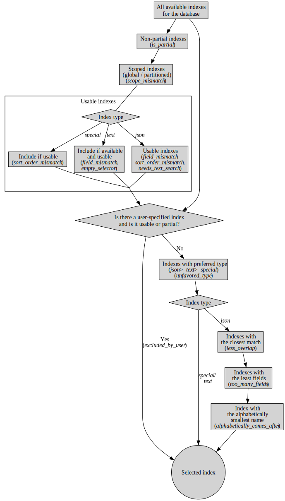

.. Licensed under the Apache License, Version 2.0 (the "License"); you may not
.. use this file except in compliance with the License. You may obtain a copy of
.. the License at
..
..   http://www.apache.org/licenses/LICENSE-2.0
..
.. Unless required by applicable law or agreed to in writing, software
.. distributed under the License is distributed on an "AS IS" BASIS, WITHOUT
.. WARRANTIES OR CONDITIONS OF ANY KIND, either express or implied. See the
.. License for the specific language governing permissions and limitations under
.. the License.

.. _api/db/_find:

===============
``/{db}/_find``
===============

.. http:post:: /{db}/_find
    :synopsis: Find documents within a given database.

    Find documents using a declarative JSON querying syntax.  Queries
    will use custom indexes, specified using the :ref:`_index
    <api/db/find/index>` endpoint, if available.  Otherwise, when
    allowed, they use the built-in :ref:`_all_docs <api/db/all_docs>`
    index, which can be arbitrarily slow.

    :param db: Database name

    :<header Content-Type: - :mimetype:`application/json`

    :<json object selector: JSON object describing criteria used to select
        documents. More information provided in the section on :ref:`selector
        syntax <find/selectors>`. *Required*
    :<json number limit: Maximum number of results returned. Default is ``25``.
        *Optional*
    :<json number skip: Skip the first 'n' results, where 'n' is the value
        specified. *Optional*
    :<json array sort: JSON array following :ref:`sort syntax <find/sort>`.
        *Optional*
    :<json array fields: JSON array specifying which fields of each object
        should be returned. If it is omitted, the entire object is returned.
        More information provided in the section on :ref:`filtering fields
        <find/filter>`. *Optional*
    :<json string|array use_index: Request a query to use a specific
        index. Specified either as ``"<design_document>"`` or
        ``["<design_document>", "<index_name>"]``. It is not
        guaranteed that the index will be actually used because if the
        index is not valid for the selector, fallback to a valid index
        is attempted. Therefore that is more like a hint. When
        fallback occurs, the details are given in the ``warning``
        field of the response. *Optional*
    :<json boolean allow_fallback: Tell if it is allowed to fall back
        to another valid index.  This can happen on running a query
        with an index specified by ``use_index`` which is not deemed
        usable, or when only the built-in :ref:`_all_docs
        <api/db/all_docs>` index would be picked in lack of indexes
        available to support the query.  Disabling this fallback logic
        causes the endpoint immediately return an error in such cases.
        Default is ``true``. *Optional*
    :<json boolean conflicts: Include conflicted documents if ``true``.
        Intended use is to easily find conflicted documents, without an
        index or view. Default is ``false``. *Optional*
    :<json number r: Read quorum needed for the result. This defaults to 1, in
        which case the document found in the index is returned. If set to a
        higher value, each document is read from at least that many replicas
        before it is returned in the results. This is likely to take more time
        than using only the document stored locally with the index. *Optional,
        default: 1*
    :<json string bookmark: A string that enables you to specify which page of
        results you require. Used for paging through result sets. Every query
        returns an opaque string under the ``bookmark`` key that can then be
        passed back in a query to get the next page of results. If any part of
        the selector query changes between requests, the results
        are undefined. *Optional, default: null*
    :<json boolean update: Whether to update the index prior to returning the
        result. Default is ``true``. *Optional*
    :<json boolean stable: Whether or not the view results should be returned
        from a "stable" set of shards. *Optional*
    :<json string stale: Combination of ``update=false`` and ``stable=true``
        options. Possible options: ``"ok"``, ``false`` (default). *Optional*
        Note that this parameter is deprecated. Use ``stable`` and ``update`` instead.
        See :ref:`views/generation` for more details.
    :<json boolean execution_stats: Include
        :ref:`execution statistics <find/statistics>` in the query response.
        *Optional, default:* ``false``

    :>header Content-Type: - :mimetype:`application/json`
    :>header Transfer-Encoding: ``chunked``

    :>json object docs: Array of documents matching the search. In each matching
        document, the fields specified in the ``fields`` part of the request
        body are listed, along with their values.
    :>json string warning: Execution warnings
    :>json object execution_stats: Execution statistics
    :>json string bookmark: An opaque string used for paging. See the
        ``bookmark`` field in the request (above) for usage details.

    :code 200: Request completed successfully
    :code 400: Invalid request
    :code 401: Read permission required
    :code 403: Insufficient permissions / :ref:`Too many requests with invalid credentials<error/403>`
    :code 404: Requested database not found
    :code 500: Query execution error

The ``limit`` and ``skip`` values are exactly as you would expect. While
``skip`` exists, it is not intended to be used for paging. The reason is that
the ``bookmark`` feature is more efficient.

    **Request**:

Example request body for finding documents using an index:

    .. code-block:: http

        POST /movies/_find HTTP/1.1
        Accept: application/json
        Content-Type: application/json
        Content-Length: 168
        Host: localhost:5984

        {
            "selector": {
                "year": {"$gt": 2010}
            },
            "fields": ["_id", "_rev", "year", "title"],
            "sort": [{"year": "asc"}],
            "limit": 2,
            "skip": 0,
            "execution_stats": true
        }

    **Response**:

Example response when finding documents using an index:

    .. code-block:: http

        HTTP/1.1 200 OK
        Cache-Control: must-revalidate
        Content-Type: application/json
        Date: Thu, 01 Sep 2016 15:41:53 GMT
        Server: CouchDB (Erlang OTP)
        Transfer-Encoding: chunked

        {
            "docs": [
                {
                    "_id": "176694",
                    "_rev": "1-54f8e950cc338d2385d9b0cda2fd918e",
                    "year": 2011,
                    "title": "The Tragedy of Man"
                },
                {
                    "_id": "780504",
                    "_rev": "1-5f14bab1a1e9ac3ebdf85905f47fb084",
                    "year": 2011,
                    "title": "Drive"
                }
            ],
            "execution_stats": {
                "total_keys_examined": 200,
                "total_docs_examined": 200,
                "total_quorum_docs_examined": 0,
                "results_returned": 2,
                "execution_time_ms": 5.52
            }
        }

.. _find/sort:

Sort Syntax
===========

The ``sort`` field contains a list of field name and direction pairs, expressed
as a basic array. The first field name and direction pair is the topmost level
of sort. The second pair, if provided, is the next level of sort.

The field can be any field, using dotted notation if desired for sub-document
fields.

The direction value is ``"asc"`` for ascending, and ``"desc"`` for descending.
If you omit the direction value, the default ``"asc"`` is used.

Example, sorting by 2 fields:

    .. code-block:: javascript

        [{"fieldName1": "desc"}, {"fieldName2": "desc"}]

Example, sorting by 2 fields, assuming default direction for both :

    .. code-block:: javascript

        ["fieldNameA", "fieldNameB"]

A typical requirement is to search for some content using a selector, then to
sort the results according to the specified field, in the required direction.

To use sorting, ensure that:

-  At least one of the sort fields is included in the selector.
-  There is an index already defined, with all the sort fields in the same
   order.
-  Each object in the sort array has a single key.

If an object in the sort array does not have a single key, the resulting sort
order is implementation specific and might change.

Find does not support multiple fields with different sort orders, so the
directions must be either all ascending or all descending.

For field names in text search sorts, it is sometimes necessary for a
field type to be specified, for example:

.. code-block:: javascript

    {
        "<fieldname>:string": "asc"
    }

If possible, an attempt is made to discover the field type based on the
selector. In ambiguous cases the field type must be provided explicitly.

The sorting order is undefined when fields contain different data types.
This is an important difference between text and view indexes. Sorting
behavior for fields with different data types might change in future
versions.

A simple query, using sorting:

.. code-block:: javascript

    {
        "selector": {"Actor_name": "Robert De Niro"},
        "sort": [{"Actor_name": "asc"}, {"Movie_runtime": "asc"}]
    }
.. _find/filter:

Filtering Fields
================

It is possible to specify exactly which fields are returned for a document when
selecting from a database. The two advantages are:

-  Your results are limited to only those parts of the document that are
   required for your application.
-  A reduction in the size of the response.

The fields returned are specified as an array.

Only the specified filter fields are included, in the response. There is no
automatic inclusion of the ``_id`` or other metadata fields when a field list
is included.

Example of selective retrieval of fields from matching documents:

.. code-block:: javascript

   {
       "selector": { "Actor_name": "Robert De Niro" },
       "fields": ["Actor_name", "Movie_year", "_id", "_rev"]
   }

Pagination
==========

Mango queries support pagination via the bookmark field. Every ``_find``
response contains a bookmark - a token that CouchDB uses to determine
where to resume from when subsequent queries are made. To get the next
set of query results, add the bookmark that was received in the previous
response to your next request. Remember to keep the `selector` the same,
otherwise you will receive unexpected results. To paginate backwards,
you can use a previous bookmark to return the previous set of results.

Note that the presence of a bookmark does not guarantee that there are
more results. You can to test whether you have reached the end of the
result set by comparing the number of results returned with the page
size requested - if results returned < `limit`, there are no more.

.. _find/statistics:

Execution Statistics
====================

Find can return basic execution statistics for a specific request. Combined with
the :ref:`_explain <api/db/find/explain>` endpoint, this should provide some
insight as to whether indexes are being used effectively.

The execution statistics currently include:

+--------------------------------+--------------------------------------------+
| Field                          | Description                                |
+================================+============================================+
| ``total_keys_examined``        | Number of index keys examined.             |
+--------------------------------+--------------------------------------------+
| ``total_docs_examined``        | Number of documents fetched from the       |
|                                | database / index, equivalent to using      |
|                                | ``include_docs=true`` in a view.           |
|                                | These may then be filtered in-memory to    |
|                                | further narrow down the result set based   |
|                                | on the selector.                           |
+--------------------------------+--------------------------------------------+
| ``total_quorum_docs_examined`` | Number of documents fetched from the       |
|                                | database using an out-of-band document     |
|                                | fetch. This is only non-zero when read     |
|                                | quorum > 1 is specified in the query       |
|                                | parameters.                                |
+--------------------------------+--------------------------------------------+
| ``results_returned``           | Number of results returned from the query. |
|                                | Ideally this should not be significantly   |
|                                | lower than the total documents / keys      |
|                                | examined.                                  |
+--------------------------------+--------------------------------------------+
| ``execution_time_ms``          | Total execution time in milliseconds as    |
|                                | measured by the database.                  |
+--------------------------------+--------------------------------------------+

.. _api/db/find/index:

================
``/{db}/_index``
================

.. _api/db/find/index-post:

Mango is a declarative JSON querying language for CouchDB databases.
Mango wraps several index types, starting with the Primary Index
out-of-the-box. Mango indexes, with index type `json`, are
built using MapReduce Views.

.. http:post:: /{db}/_index
    :synopsis: Create a new index.

    Create a new index on a database

    :param db: Database name

    :<header Content-Type: - :mimetype:`application/json`

    :query object index: JSON object describing the index to create. (Depends
        on the type of index, see :ref:`ddoc/mango/indexes`)
    :query string ddoc: Name of the design document in which the index will be
        created. By default, each index will be created in its own design
        document.
        Indexes can be grouped into design documents for efficiency. However, a
        change to one index in a design document will invalidate all other
        indexes in the same document (similar to views). *Optional*
    :query string name: Name of the index. If no name is provided, a name will
        be generated automatically. *Optional*
    :query string type: Can be ``"json"``, ``"text"`` (for clouseau), or
        ``"nouveau"``. Defaults to ``"json"``. Text and Nouveau indexes are
        related to those features, and are only available if those features are
        installed. *Optional*
    :query boolean partitioned: Determines whether a JSON index is partitioned
        or global. The default value of ``partitioned`` is the ``partitioned``
        property of the database. To create a global index on a
        partitioned database, specify
        ``false`` for the ``"partitioned"`` field. If you specify ``true``
        for the  ``"partitioned"`` field on an unpartitioned database, an
        error occurs.

    :>header Content-Type: - :mimetype:`application/json`
    :>header Transfer-Encoding: ``chunked``

    :>json string result: Flag to show whether the index was created or one
        already exists. Can be ``"created"`` or ``"exists"``.
    :>json string id: Id of the design document the index was created in.
    :>json string name: Name of the index created.

    :code 200: Index created successfully or already exists
    :code 400: Invalid request
    :code 401: Admin permission required
    :code 403: Insufficient permissions / :ref:`Too many requests with invalid credentials<error/403>`
    :code 404: Database not found
    :code 500: Execution error

    Example of creating a new index for a field called ``foo``:

    **Request**:

    .. code-block:: http

        POST /db/_index HTTP/1.1
        Content-Type: application/json
        Content-Length: 116
        Host: localhost:5984

        {
            "index": {
                "fields": ["foo"]
            },
            "name" : "foo-index",
            "type" : "json"
        }

The returned JSON confirms the index has been created:

    **Response**:

    .. code-block:: http

        HTTP/1.1 200 OK
        Cache-Control: must-revalidate
        Content-Length: 96
        Content-Type: application/json
        Date: Thu, 01 Sep 2016 18:17:48 GMT
        Server: CouchDB (Erlang OTP/18)

        {
            "result":"created",
            "id":"_design/a5f4711fc9448864a13c81dc71e660b524d7410c",
            "name":"foo-index"
        }

Example index creation using all available query parameters:

    **Request**:

    .. code-block:: http

        POST /db/_index HTTP/1.1
        Content-Type: application/json
        Content-Length: 396
        Host: localhost:5984

        {
            "index": {
                "partial_filter_selector": {
                    "year": {
                        "$gt": 2010
                    },
                    "limit": 10,
                    "skip": 0
                },
                "fields": [
                    "_id",
                    "_rev",
                    "year",
                    "title"
                ]
            },
            "ddoc": "example-ddoc",
            "name": "example-index",
            "type": "json",
            "partitioned": false
        }

By default, a JSON index will include all documents that have the indexed fields
present, including those which have ``null`` values.

.. _api/db/find/index-get:

.. http:get:: /{db}/_index
    :synopsis: List all indexes.

    When you make a ``GET`` request to ``/{db}/_index``, you get a list of all
    indexes in the database. In addition to the information available through
    this API, indexes are also stored in design documents as :ref:`views <viewfun>`.
    Design documents are regular documents that have an ID starting with
    ``_design/``. Design documents can be retrieved and modified in the same
    way as any other document, although this is not necessary when using Mango.

    :param db: Database name.

    :>header Content-Type: - :mimetype:`application/json`
    :>header Transfer-Encoding: ``chunked``

    :>json number total_rows: Number of indexes.
    :>json array indexes: Array of index definitions (see
        :ref:`ddoc/mango/indexes/definitions`).

    :code 200: Success
    :code 400: Invalid request
    :code 401: Read permission required
    :code 403: Insufficient permissions / :ref:`Too many requests with invalid credentials<error/403>`
    :code 500: Execution error

    **Request**:

    .. code-block:: http

        GET /db/_index HTTP/1.1
        Accept: application/json
        Host: localhost:5984

    **Response**:

    .. code-block:: http

        HTTP/1.1 200 OK
        Cache-Control: must-revalidate
        Content-Length: 238
        Content-Type: application/json
        Date: Thu, 01 Sep 2016 18:17:48 GMT
        Server: CouchDB (Erlang OTP/18)

        {
            "total_rows": 2,
            "indexes": [
            {
                "ddoc": null,
                "name": "_all_docs",
                "type": "special",
                "def": {
                    "fields": [
                        {
                            "_id": "asc"
                        }
                    ]
                }
            },
            {
                "ddoc": "_design/a5f4711fc9448864a13c81dc71e660b524d7410c",
                "name": "foo-index",
                "partitioned": false,
                "type": "json",
                "def": {
                    "fields": [
                        {
                            "foo": "asc"
                        }
                    ]
                }
            }
          ]
        }

.. _api/db/find/index-delete:

.. http:delete:: /{db}/_index/{design_doc}/json/{name}
    :synopsis: Delete an index.

    :param db: Database name.
    :param design_doc: Design document name.  The ``_design/`` prefix
                       is not required.
    :param name: Index name.

    :>header Content-Type: - :mimetype:`application/json`

    :>json string ok: `"true"` if successful.

    :code 200: Success
    :code 400: Invalid request
    :code 401: Writer permission required
    :code 403: Insufficient permissions / :ref:`Too many requests with invalid credentials<error/403>`
    :code 404: Index not found
    :code 500: Execution error

    **Request**:

    .. code-block:: http

        DELETE /db/_index/_design/a5f4711fc9448864a13c81dc71e660b524d7410c/json/foo-index HTTP/1.1
        Accept: */*
        Host: localhost:5984

    **Response**:

    .. code-block:: http

        HTTP/1.1 200 OK
        Cache-Control: must-revalidate
        Content-Length: 12
        Content-Type: application/json
        Date: Thu, 01 Sep 2016 19:21:40 GMT
        Server: CouchDB (Erlang OTP/18)

        {
            "ok": true
        }

.. _api/db/find/index-bulk-delete:

.. http:post:: /{db}/_index/_bulk_delete
   :synopsis: Delete indexes in bulk.

   :param db: Database name

   :<header Content-Type: - :mimetype:`application/json`

   :<json array docids: List of names for indexes to be deleted.
   :<json number w: Write quorum for each of the deletions.  Default
      is ``2``. *Optional*

   :>header Content-Type: - :mimetype:`application/json`

   :>json array success: An array of objects that represent successful
      deletions per index.  The ``id`` key contains the name of the
      index, and ``ok`` reports if the operation has completed
   :>json array fail: An array of object that describe failed
      deletions per index.  The ``id`` key names the corresponding
      index, and ``error`` describes the reason for the failure

   :code 200: Success
   :code 400: Invalid request
   :code 401: Unauthorized request to a protected API
   :code 403: Insufficient permissions / :ref:`Too many requests with invalid credentials<error/403>`
   :code 404: Requested database not found
   :code 500: Execution error

   **Request**:

   .. code-block:: http

        POST /db/_index/_bulk_delete HTTP/1.1
        Accept: application/json
        Content-Type: application/json
        Host: localhost:5984

        {
            "docids": [
                "_design/example-ddoc",
                "foo-index",
                "nonexistent-index"
            ]
        }

   **Response**:

   .. code-block:: http

        HTTP/1.1 200 OK
        Cache-Control: must-revalidate
        Content-Length: 94
        Content-Type: application/json
        Date: Thu, 01 Sep 2016 19:26:59 GMT
        Server: CouchDB (Erlang OTP/18)

        {
            "success": [
                {
                    "id": "_design/example-ddoc",
                    "ok": true
                },
                {
                    "id": "foo-index",
                    "ok": true
                }
            ],
            "fail": [
                {
                    "id": "nonexistent-index",
                    "error": "not_found"
                }
            ]
        }

.. _api/db/find/explain:

==================
``/{db}/_explain``
==================

.. http:post:: /{db}/_explain
    :synopsis: Identify which index is being used by a particular query.

    Shows which index is being used by the query.  Parameters are the same as
    :ref:`_find <api/db/_find>`.

    :param db: Database name

    :<header Content-Type: - :mimetype:`application/json`

    :>header Content-Type: - :mimetype:`application/json`
    :>header Transfer-Encoding: ``chunked``

    :>json boolean covering: Tell if the query could be answered only
        by relying on the data stored in the index.  When ``true``, no
        documents are fetched, which results in a faster response.
    :>json string dbname: Name of database.
    :>json object index: Index used to fulfill the query.
    :>json object selector: Query selector used.
    :>json object opts: Query options used.
    :>json object mrargs: Arguments passed to the underlying view.
    :>json number limit: Limit parameter used.
    :>json number skip: Skip parameter used.
    :>json array fields: Fields to be returned by the query.  The `[]`
       value here means all the fields, since there is no projection
       happening in that case.
    :>json boolean partitioned: The database is partitioned or not.
    :>json array index_candidates: The list of all indexes that were
       found but not selected for serving the query.  See :ref:`the
       section on index selection <find/index_selection>` below for
       the details.
    :>json object selector_hints: Extra information on the selector to
       provide insights about its usability.

    :code 200: Request completed successfully
    :code 400: Invalid request
    :code 401: Read permission required
    :code 403: Insufficient permissions / :ref:`Too many requests with invalid credentials<error/403>`
    :code 500: Execution error

    **Request**:

    .. code-block:: http

        POST /movies/_explain HTTP/1.1
        Accept: application/json
        Content-Type: application/json
        Content-Length: 168
        Host: localhost:5984

        {
            "selector": {
                "year": {"$gt": 2010}
            },
            "fields": ["_id", "_rev", "year", "title"],
            "sort": [{"year": "asc"}],
            "limit": 2,
            "skip": 0
        }

    **Response**:

    .. code-block:: http

        HTTP/1.1 200 OK
        Cache-Control: must-revalidate
        Content-Type: application/json
        Date: Thu, 01 Sep 2016 15:41:53 GMT
        Server: CouchDB (Erlang OTP)
        Transfer-Encoding: chunked

        {
            "dbname": "movies",
            "index": {
                "ddoc": "_design/0d61d9177426b1e2aa8d0fe732ec6e506f5d443c",
                "name": "0d61d9177426b1e2aa8d0fe732ec6e506f5d443c",
                "type": "json",
                "partitioned": false,
                "def": {
                    "fields": [
                        {
                            "year": "asc"
                        }
                    ]
                }
            },
            "partitioned": false,
            "selector": {
                "year": {
                    "$gt": 2010
                }
            },
            "opts": {
                "use_index": [],
                "bookmark": "nil",
                "limit": 2,
                "skip": 0,
                "sort": {},
                "fields": [
                    "_id",
                    "_rev",
                    "year",
                    "title"
                ],
                "partition": "",
                "r": 1,
                "conflicts": false,
                "stale": false,
                "update": true,
                "stable": false,
                "execution_stats": false,
                "allow_fallback": true
            },
            "limit": 2,
            "skip": 0,
            "fields": [
                "_id",
                "_rev",
                "year",
                "title"
            ],
            "mrargs": {
                "include_docs": true,
                "view_type": "map",
                "reduce": false,
                "partition": null,
                "start_key": [
                    2010
                ],
                "end_key": [
                    "<MAX>"
                ],
                "direction": "fwd",
                "stable": false,
                "update": true,
                "conflicts": "undefined"
            },
            "covering": false
            "index_candidates": [
                {
                    "index": {
                        "ddoc": null,
                        "name": "_all_docs",
                        "type": "special",
                        "def": {
                            "fields": [
                                {
                                    "_id": "asc"
                                }
                            ]
                        }
                    },
                    "analysis": {
                        "usable": true,
                        "reasons": [
                            {
                                "name": "unfavored_type"
                            }
                        ],
                        "ranking": 1,
                        "covering": null
                    }
                }
            ],
            "selector_hints": [
                {
                    "type": "json",
                    "indexable_fields": [
                        "year"
                    ],
                    "unindexable_fields": []
                }
            ]
        }

.. _find/index_selection:

Index selection
===============

:ref:`_find <api/db/_find>` chooses which index to use for responding
to a query, unless you specify an index at query time.  In this
section, a brief overview of the index selection process is presented.

.. note::

    It is good practice to specify indexes explicitly in your
    queries. This prevents existing queries being affected by new
    indexes that might get added in a production environment.

.. note::

   Both the :ref:`_explain <api/db/find/explain>` and :ref:`_find
   <api/db/_find>` endpoints rely on the same index selection logic.
   But :ref:`_explain <api/db/find/explain>` is a bit more elaborate,
   therefore it could be used for simulation and exploration.  In the
   output, details for discarding indexes are placed in the
   ``analysis`` field of the JSON objects under ``index_candidates``.
   Under ``analysis`` the exact reason is listed in the ``reasons``
   field.  Each reason has a specific code, which will be mentioned at
   the relevant subsections below.

The index selection happens in multiple rounds.

     Steps of index selection

First, all the indexes for the database are collected.  The result
always includes the special entity called `all docs` which is the
primary index on the ``_id`` field.  This is reserved as a catch-all
answer when no other suitable indexes could be found, but its use of
discouraged for performance reasons.

In the next round, :ref:`partial indexes <find/partial_indexes>` are
eliminated unless specified in the ``use_index`` field of the query
object.

After that, indexes are filtered according whether a global or
partitioned query was issued.  Indexes that do not match the query
scope are assigned a ``scope_mismatch`` reason code.

The remaining indexes are filtered by a series of usability checks.

Each usability check is supplied with its own reason code.  That is
``field_mismatch`` for the cases when the fields in the index do not
match with that of the selector.  The code ``sort_order_mismatch``
means that the requested sorting does not align with the index.
These checks depend on the type of index.

- ``"special"``: Usable if no ``sort`` is specified in the query or
  ``sort`` is specified on ``_id`` only.

- ``"json"``: The selector must not request a free-form text search
  via the ``$text`` operator.  The ``needs_text_search`` reason code
  is returned otherwise.

  All the fields in the index must be referenced by the ``selector``
  or ``sort`` in the query.

  Any ``sort`` specified in the query must match the order of the
  fields in the index.

- ``"text"``: The index must contain fields that are referenced by the
  query ``"selector"`` or ``"sort"``.

  The ``"text"`` indexes do not work empty selectors, and they return
  a ``empty_selector`` reason code in response to that.

After the usable indexes having gathered, the user-specified index is
verified next.  If this is a valid, usable index, then every other
usable index is excluded with the ``excluded_by_user`` code.
Otherwise, it is ignored an the process continues with the rest of the
usable indexes.

There is a natural order of preference among the various index types:
``"json"``, ``"text"``, and then ``"special"``.  The usable indexes
are grouped by their types in this order and the search is narrowed
down to the elements of the first group.  That is, even if there is a
``"text"`` index present that could match with the selector, it might
be discarded if a ``"json"`` index with the suitable fields could be
identified.  Indexes dropped in this round are all tagged with the
``unfavored_type`` reason code.

There could be only a single ``"text"`` and ``"special"`` index per
database, hence the selection ends in this phase for thoses cases.
For ``"json"`` indexes, an additional round is run to find the ideal
index.

The query planner looks at the selector section and finds the index
with the closest match to operators and fields used in the query.
This is described by the ``less_overlap`` reason code.  If there are
two or more ``"json"``-type indexes that match, the index with the
least number of fields in the index is preferred.  This is marked by
the ``too_many_fields`` reason code.  If there are still two or more
candidate indexes, the index with the first alphabetical name is
chosen.  This is reflected by the ``alphabetically_comes_after``
reason code.

+--------------------------------+------------+------------------------------------------+
| Reason Code                    | Index Type | Description                              |
+================================+============+==========================================+
| ``alphabetically_comes_after`` | json       | There is another suitable index whose    |
|                                |            | name comes before that of this index.    |
+--------------------------------+------------+------------------------------------------+
| ``empty_selector``             | text       | ``"text"`` indexes do not support        |
|                                |            | queries with empty selectors.            |
+--------------------------------+------------+------------------------------------------+
| ``excluded_by_user``           | any        | ``use_index`` was used to manually       |
|                                |            | specify the index.                       |
+--------------------------------+------------+------------------------------------------+
| ``field_mismatch``             | any        | Fields in ``"selector"`` of the query do |
|                                |            | not match with the fields available in   |
|                                |            | the index.                               |
+--------------------------------+------------+------------------------------------------+
| ``is_partial``                 | json, text | Partial indexes can be selected only     |
|                                |            | manually.                                |
+--------------------------------+------------+------------------------------------------+
| ``less_overlap``               | json       | There is a better match of fields        |
|                                |            | available within the indexes for the     |
|                                |            | query.                                   |
+--------------------------------+------------+------------------------------------------+
| ``needs_text_search``          | json       | The use of the ``$text`` operator        |
|                                |            | requires a ``"text"`` index.             |
+--------------------------------+------------+------------------------------------------+
| ``scope_mismatch``             | json       | The scope of the query and the index is  |
|                                |            | not the same.                            |
+--------------------------------+------------+------------------------------------------+
| ``sort_order_mismatch``        | json,      | Fields in ``"sort"`` of the query do not |
|                                | special    | match with the fields available in the   |
|                                |            | index.                                   |
+--------------------------------+------------+------------------------------------------+
| ``too_many_fields``            | json       | The index has more fields than the       |
|                                |            | chosen one.                              |
+--------------------------------+------------+------------------------------------------+
| ``unfavored_type``             | any        | The type of the index is not preferred.  |
+--------------------------------+------------+------------------------------------------+

In the :ref:`_explain <api/db/find/explain>` output, some additional
information on the candidate indexes could be found too as part of the
``analysis`` object.

- The ``ranking`` (`number`) attribute defines a loose ordering on the
  items of the list, which might be used to order them.  This is a
  positive integer which is the greater the index is farther down in
  the queue.  Virtually, the selected index is of rank ``0`` always,
  everything else must come after that one.  The rank reflects the
  final position of the given index candidate in the tournament
  described above.

- The ``usable`` (`Boolean`) attribute tells if the index is usable at
  all.  This could be used to partition the index candidates by their
  usability in relation to the selector.

- The ``covering`` (`Boolean`) attribute tells if the index is a
  covering index or not.  This property is calculated for ``"json"``
  indexes only and it is ``null`` in every other case.
