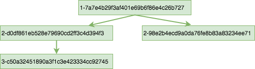
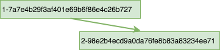

.. Licensed under the Apache License, Version 2.0 (the "License"); you may not
.. use this file except in compliance with the License. You may obtain a copy of
.. the License at
..
..   http://www.apache.org/licenses/LICENSE-2.0
..
.. Unless required by applicable law or agreed to in writing, software
.. distributed under the License is distributed on an "AS IS" BASIS, WITHOUT
.. WARRANTIES OR CONDITIONS OF ANY KIND, either express or implied. See the
.. License for the specific language governing permissions and limitations under
.. the License.

.. _api/db/purge:

==============
``/db/_purge``
==============

.. http:post:: /{db}/_purge
    :synopsis: Purges documents entirely from database

    A database purge permanently removes the references to documents
    in the database. Normal deletion of a document within CouchDB does not
    remove the document from the database, instead, the document is marked as
    ``_deleted=true`` (and a new revision is created). This is to ensure that
    deleted documents can be replicated to other databases as having been
    deleted. This also means that you can check the status of a document and
    identify that the document has been deleted by its absence.

    The purge request must include the document IDs, and for each
    document ID, one or more revisions that must be purged. Documents can be
    previously deleted, but it is not necessary. Revisions must be leaf
    revisions.

    The response will contain a list of the document IDs and revisions
    successfully purged.

    :param db: Database name
    :<header Accept: - :mimetype:`application/json`
                     - :mimetype:`text/plain`
    :<header Content-Type: :mimetype:`application/json`
    :<json object: Mapping of document ID to list of revisions to purge
    :>header Content-Type: - :mimetype:`application/json`
                           - :mimetype:`text/plain; charset=utf-8`
    :>json string purge_seq: Purge sequence string
    :>json object purged: Mapping of document ID to list of purged revisions
    :code 201: Request completed successfully
    :code 202: Request was accepted, and was completed successfully on at least
               one replica, but quorum was not reached.
    :code 400: Invalid database name or JSON payload
    :code 415: Bad :header:`Content-Type` value
    :code 500: Internal server error or timeout

    **Request**:

    .. code-block:: http

        POST /db/_purge HTTP/1.1
        Accept: application/json
        Content-Length: 76
        Content-Type: application/json
        Host: localhost:5984

        {
            "c6114c65e295552ab1019e2b046b10e": [
                "3-b06fcd1c1c9e0ec7c480ee8aa467bf3b",
                "3-c50a32451890a3f1c3e423334cc92745"
            ]
        }

    **Response**:

    .. code-block:: http

        HTTP/1.1 201 Created
        Cache-Control: must-revalidate
        Content-Length: 107
        Content-Type: application/json
        Date: Fri, 02 Jun 2017 18:55:54 GMT
        Server: CouchDB/2.0.0-2ccd4bf (Erlang OTP/18)

        {
          "purge_seq": null,
          "purged": {
            "c6114c65e295552ab1019e2b046b10e": [
                "3-c50a32451890a3f1c3e423334cc92745"
              ]
          }
        }

     Document Revision Tree 1

For example, given the above purge tree and issuing the above purge request,
the whole document will be purged, as it contains only a single branch with a
leaf revision  `3-c50a32451890a3f1c3e423334cc92745` that will be purged.
As a result of this purge operation, a document with
`_id:c6114c65e295552ab1019e2b046b10e` will be completely removed from the
database's document b+tree, and sequence b+tree. It will not be available
through ``_all_docs`` or ``_changes`` endpoints, as though this document never
existed. Also as a result of purge operation, the database's ``purge_seq`` and
``update_seq`` will be increased.

Notice, how revision `3-b06fcd1c1c9e0ec7c480ee8aa467bf3b` was ignored. Revisions
that have already been purged and non-leaf revisions are ignored in a purge
request.

If a document has two conflict revisions with the following revision history:

     Document Revision Tree 2

the above purge request will purge only one branch, leaving the document's
revision tree with only a single branch:

    Document Revision Tree 3

As a result of this purge operation, a new updated version of the document will
be available in ``_all_docs`` and ``_changes``, creating a new record in ``_changes``.
The database's ``purge_seq`` and ``update_seq`` will be increased.

Internal Replication
======================
Purges are automatically replicated between replicas of the same database. Each
database has an internal purge tree that stores a certain number of the most
recent purges. This allows internal synchronization between replicas of the same
database.

External Replication
======================
Purge operations are not replicated to other external databases. External
replication works by identifying a source's document revisions that are missing
on target, and copying these revisions from source to target. A purge operation
completely purges revisions from a document's purge tree making external
replication of purges impossible.

    .. note::
      If you need a purge to be effective across multiple effective databases, you
      must run the purge separately on each of the databases.

Updating Indexes
================

The number of purges on a database is tracked using a purge sequence. This is
used by the view indexer to optimize the updating of views that contain the
purged documents.

Each internal database indexer, including the view indexer, keeps its own purge
sequence. The purge sequence stored in the index can be much smaller than the
database's purge sequence up to the number of purge requests allowed to be
stored in the purge trees of the database. Multiple purge requests can be
processed by the indexer without incurring a rebuild of the index. The index
will be updated according to these purge requests.

The index of documents is based on the winner of the revision tree. Depending on
which revision is specified in the purge request, the index update observes the
following behavior:

- If the winner of the revision tree is not specified in the purge request,
  there is no change to the index record of this document.
- If the winner of the revision tree is specified in the purge request, and
  there is still a revision left after purging, the index record of the document
  will be built according to the new winner of the revision tree.
- If all revisions of the document are specified in the purge request, the index
  record of the document will be deleted. The document will no longer be found
  in searches.

.. _api/db/_purged_infos_limit:

==============================
``/db/_purged_infos_limit``
==============================

.. http:get:: /{db}/_purged_infos_limit
    :synopsis: Returns the limit of historical purges to store in the database

    Gets the current ``purged_infos_limit`` (purged documents limit) setting,
    the maximum number of historical purges (purged document Ids with their
    revisions) that can be stored in the database.

    :param db: Database name
    :<header Accept: - :mimetype:`application/json`
                     - :mimetype:`text/plain`
    :>header Content-Type: - :mimetype:`application/json`
                           - :mimetype:`text/plain; charset=utf-8`
    :code 200: Request completed successfully

    **Request**:

    .. code-block:: http

        GET /db/_purged_infos_limit HTTP/1.1
        Accept: application/json
        Host: localhost:5984

    **Response**:

    .. code-block:: http

        HTTP/1.1 200 OK
        Cache-Control: must-revalidate
        Content-Length: 5
        Content-Type: application/json
        Date: Wed, 14 Jun 2017 14:43:42 GMT
        Server: CouchDB (Erlang/OTP)

        1000

.. http:put:: /{db}/_purged_infos_limit
    :synopsis: Sets the limit of historical purges to store in the database

    Sets the maximum number of purges (requested purged Ids with their
    revisions) that will be tracked in the database, even after compaction has
    occurred. You can set the purged documents limit on a database with a scalar
    integer of the limit that you want to set as the request body.

    The default value of historical stored purges is 1000. This means up to 1000
    purges can be synchronized between replicas of the same databases in case of
    one of the replicas was down when purges occurred.

    This request sets the soft limit for stored purges. During the compaction
    CouchDB will try to keep only `_purged_infos_limit` of purges in the
    database, but occasionally the number of stored purges can exceed this
    value. If a database has not completed purge synchronization with active
    indexes or active internal replications, it may temporarily store a higher
    number of historical purges.

    :param db: Database name
    :<header Accept: - :mimetype:`application/json`
                     - :mimetype:`text/plain`
    :<header Content-Type: :mimetype:`application/json`
    :>header Content-Type: - :mimetype:`application/json`
                           - :mimetype:`text/plain; charset=utf-8`
    :>json boolean ok: Operation status
    :code 200: Request completed successfully
    :code 400: Invalid JSON data

    **Request**:

    .. code-block:: http

        PUT /db/_purged_infos_limit HTTP/1.1
        Accept: application/json
        Content-Length: 4
        Content-Type: application/json
        Host: localhost:5984

        1500

    **Response**:

    .. code-block:: http

        HTTP/1.1 200 OK
        Cache-Control: must-revalidate
        Content-Length: 12
        Content-Type: application/json
        Date: Wed, 14 Jun 2017 14:45:34 GMT
        Server: CouchDB (Erlang/OTP)

        {
            "ok": true
        }

.. _api/db/missing_revs:

=====================
``/db/_missing_revs``
=====================

.. http:post:: /{db}/_missing_revs
    :synopsis: By given list of document revisions returns the document
               revisions that do not exist in the database

    With given a list of document revisions, returns the document revisions
    that do not exist in the database.

    :param db: Database name
    :<header Accept: - :mimetype:`application/json`
                     - :mimetype:`text/plain`
    :<header Content-Type: :mimetype:`application/json`
    :<json object: Mapping of document ID to list of revisions to lookup
    :>header Content-Type: - :mimetype:`application/json`
                           - :mimetype:`text/plain; charset=utf-8`
    :>json object missing_revs: Mapping of document ID to list of missed
      revisions
    :code 200: Request completed successfully
    :code 400: Invalid database name or JSON payload

    **Request**:

    .. code-block:: http

        POST /db/_missing_revs HTTP/1.1
        Accept: application/json
        Content-Length: 76
        Content-Type: application/json
        Host: localhost:5984

        {
            "c6114c65e295552ab1019e2b046b10e": [
                "3-b06fcd1c1c9e0ec7c480ee8aa467bf3b",
                "3-0e871ef78849b0c206091f1a7af6ec41"
            ]
        }

    **Response**:

    .. code-block:: http

        HTTP/1.1 200 OK
        Cache-Control: must-revalidate
        Content-Length: 64
        Content-Type: application/json
        Date: Mon, 12 Aug 2013 10:53:24 GMT
        Server: CouchDB (Erlang/OTP)

        {
            "missing_revs":{
                "c6114c65e295552ab1019e2b046b10e": [
                    "3-b06fcd1c1c9e0ec7c480ee8aa467bf3b"
                ]
            }
        }

.. _api/db/revs_diff:

==================
``/db/_revs_diff``
==================

.. http:post:: /{db}/_revs_diff
    :synopsis: By given list of document revisions returns differences between
               the given revisions and ones that are in the database

    Given a set of document/revision IDs, returns the subset of those that do
    not correspond to revisions stored in the database.

    Its primary use is by the replicator, as an important optimization: after
    receiving a set of new revision IDs from the source database, the
    replicator sends this set to the destination database's ``_revs_diff`` to
    find out which of them already exist there. It can then avoid fetching and
    sending already-known document bodies.

    Both the request and response bodies are JSON objects whose keys are
    document IDs; but the values are structured differently:

    - In the request, a value is an array of revision IDs for that document.

    - In the response, a value is an object with a ``missing``: key, whose
      value is a list of revision IDs for that document (the ones that are not
      stored in the database) and optionally a ``possible_ancestors`` key,
      whose value is an array of revision IDs that are known that might be
      ancestors of the missing revisions.

    :param db: Database name
    :<header Accept: - :mimetype:`application/json`
                     - :mimetype:`text/plain`
    :<header Content-Type: :mimetype:`application/json`
    :<json object: Mapping of document ID to list of revisions to lookup
    :>header Content-Type: - :mimetype:`application/json`
                           - :mimetype:`text/plain; charset=utf-8`
    :>json array missing: List of missed revisions for specified document
    :>json array possible_ancestors: List of revisions that *may be* ancestors
      for specified document and its current revision in requested database
    :code 200: Request completed successfully
    :code 400: Invalid database name or JSON payload

    **Request**:

    .. code-block:: http

        POST /db/_revs_diff HTTP/1.1
        Accept: application/json
        Content-Length: 113
        Content-Type: application/json
        Host: localhost:5984

        {
            "190f721ca3411be7aa9477db5f948bbb": [
                "3-bb72a7682290f94a985f7afac8b27137",
                "4-10265e5a26d807a3cfa459cf1a82ef2e",
                "5-067a00dff5e02add41819138abb3284d"
            ]
        }

    **Response**:

    .. code-block:: http

        HTTP/1.1 200 OK
        Cache-Control: must-revalidate
        Content-Length: 88
        Content-Type: application/json
        Date: Mon, 12 Aug 2013 16:56:02 GMT
        Server: CouchDB (Erlang/OTP)

        {
            "190f721ca3411be7aa9477db5f948bbb": {
                "missing": [
                    "3-bb72a7682290f94a985f7afac8b27137",
                    "5-067a00dff5e02add41819138abb3284d"
                ],
                "possible_ancestors": [
                    "4-10265e5a26d807a3cfa459cf1a82ef2e"
                ]
            }
        }

.. _api/db/revs_limit:

===================
``/db/_revs_limit``
===================

.. http:get:: /{db}/_revs_limit
    :synopsis: Returns the limit of historical revisions to store for
               a single document in the database

    Gets the current ``revs_limit`` (revision limit) setting.

    :param db: Database name
    :<header Accept: - :mimetype:`application/json`
                     - :mimetype:`text/plain`
    :>header Content-Type: - :mimetype:`application/json`
                           - :mimetype:`text/plain; charset=utf-8`
    :code 200: Request completed successfully

    **Request**:

    .. code-block:: http

        GET /db/_revs_limit HTTP/1.1
        Accept: application/json
        Host: localhost:5984

    **Response**:

    .. code-block:: http

        HTTP/1.1 200 OK
        Cache-Control: must-revalidate
        Content-Length: 5
        Content-Type: application/json
        Date: Mon, 12 Aug 2013 17:27:30 GMT
        Server: CouchDB (Erlang/OTP)

        1000

.. http:put:: /{db}/_revs_limit
    :synopsis: Sets the limit of historical revisions to store for
               a single document in the database

    Sets the maximum number of document revisions that will be tracked by
    CouchDB, even after compaction has occurred. You can set the revision limit
    on a database with a scalar integer of the limit that you want to set as
    the request body.

    :param db: Database name
    :<header Accept: - :mimetype:`application/json`
                     - :mimetype:`text/plain`
    :<header Content-Type: :mimetype:`application/json`
    :>header Content-Type: - :mimetype:`application/json`
                           - :mimetype:`text/plain; charset=utf-8`
    :>json boolean ok: Operation status
    :code 200: Request completed successfully
    :code 400: Invalid JSON data

    **Request**:

    .. code-block:: http

        PUT /db/_revs_limit HTTP/1.1
        Accept: application/json
        Content-Length: 5
        Content-Type: application/json
        Host: localhost:5984

        1000

    **Response**:

    .. code-block:: http

        HTTP/1.1 200 OK
        Cache-Control: must-revalidate
        Content-Length: 12
        Content-Type: application/json
        Date: Mon, 12 Aug 2013 17:47:52 GMT
        Server: CouchDB (Erlang/OTP)

        {
            "ok": true
        }
