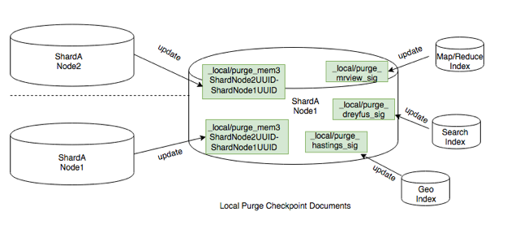

.. Licensed under the Apache License, Version 2.0 (the "License"); you may not
.. use this file except in compliance with the License. You may obtain a copy of
.. the License at
..
..   http://www.apache.org/licenses/LICENSE-2.0
..
.. Unless required by applicable law or agreed to in writing, software
.. distributed under the License is distributed on an "AS IS" BASIS, WITHOUT
.. WARRANTIES OR CONDITIONS OF ANY KIND, either express or implied. See the
.. License for the specific language governing permissions and limitations under
.. the License.

.. _cluster/purging:

===============
Clustered Purge
===============
The primary purpose of clustered purge is to clean databases that have multiple
deleted tombstones or single documents that contain large numbers of conflicts.
But it can also be used to purge any document (deleted or non-deleted) with any
number of revisions.

Clustered purge is designed to maintain eventual consistency and prevent
unnecessary invalidation of secondary indexes. For this, every database keeps
track of a certain number of historical purges requested in the database, as
well as its current ``purge_seq``. Internal replications and secondary indexes
process database's purges and periodically update their corresponding purge
checkpoint documents to report ``purge_seq`` processed by them. To ensure
eventual consistency, the database will remove stored historical purge requests
only after they have been processed by internal replication jobs and secondary
indexes.

Internal Structures
====================================
To enable internal replication of purge information between nodes and secondary
indexes, two internal purge trees were added to a database file to track
historical purges.

.. code-block:: text

    purge_tree: UUID -> {PurgeSeq, DocId, Revs}
    purge_seq_tree: PurgeSeq -> {UUID, DocId, Revs}

Each interactive request to ``_purge API``, creates an ordered set of pairs on
increasing ``purge_seq`` and purge_request, where purge_request is a tuple that
contains docid and list of revisions. For each purge_request uuid is generated.
A purge request is added to internal purge trees:
a tuple ``{UUID -> {PurgeSeq, DocId, Revs}}`` is added to ``purge_tree``,
a tuple is ``{PurgeSeq -> {UUID, DocId, Revs}}`` added ``to purge_seq_tree``.

Compaction of Purges
====================================

During the compaction of the database the oldest purge requests are to be
removed to store only ``purged_infos_limit`` number of purges in the database.
But in order to keep the database consistent with indexes and other replicas,
we can only remove purge requests that have already been processed by indexes
and internal replications jobs. Thus, occasionally purge trees may store
more than ``purged_infos_limit`` purges. If the number of stored purges in the
database exceeds ``purged_infos_limit`` by a certain threshold, a warning is
produced in logs signaling a problem of synchronization of database's purges
with indexes and other replicas.

Local Purge Checkpoint Documents
====================================
Indexes and internal replications of the database with purges create and
periodically update local checkpoint purge documents:
``_local/purge-$type-$hash``. These documents report the last ``purge_seq``
processed by them and the timestamp of the last processing. An example of a
local checkpoint purge document:

.. code-block:: json

    {
      "_id": "_local/purge-mrview-86cacdfbaf6968d4ebbc324dd3723fe7",
      "type": "mrview",
      "purge_seq": 10,
      "updated_on": 1540541874,
      "ddoc_id": "_design/foo",
      "signature": "5d10247925f826ae3e00966ec24b7bf6"
    }

The below image shows possible local checkpoint documents that a database may
have.

    Local Purge Checkpoint Documents

Internal Replication
====================================

.. rst-class:: open

Purge requests are replayed across all nodes in an eventually consistent manner.
Internal replication of purges consists of two steps:

1. Pull replication. Internal replication first starts by pulling purges from
target and applying them on source to make sure we don't reintroduce to target
source's docs/revs that have been already purged on target. In this step, we use
purge checkpoint documents stored on target to keep track of the last target's
``purge_seq`` processed by the source. We find purge requests occurred after
this ``purge_seq``, and replay them on source. This step is done by updating
the target's checkpoint purge documents with the latest process ``purge_seq``
and timestamp.

2. Push replication. Then internal replication proceeds as usual with an extra
step inserted to push source's purge requests to target. In this step, we use
local internal replication checkpoint documents, that are updated both on target
and source.

Under normal conditions, an interactive purge request is already sent to every
node containing a database shard's replica, and applied on every replica.
Internal replication of purges between nodes is just an extra step to ensure
consistency between replicas, where all purge requests on one node are replayed
on another node. In order not to replay the same purge request on a replica,
each interactive purge request is tagged with a unique ``uuid``. Internal
replication filters out purge requests with UUIDs that already exist in the
replica's ``purge_tree``, and applies only purge requests with UUIDs that don't
exist in the ``purge_tree``. This is the reason why we needed to have two
internal purge trees: 1) ``purge_tree``: ``{UUID -> {PurgeSeq, DocId, Revs}}``
allows to quickly find purge requests with UUIDs that already exist in the
replica; 2) ``purge_seq_tree``: ``{PurgeSeq -> {UUID, DocId, Revs}}`` allows to
iterate from a given ``purge_seq`` to collect all purge requests happened after
this ``purge_seq``.

Indexes
====================================
Each purge request will bump up ``update_seq`` of the database, so that each
secondary index is also updated in order to apply the purge requests to maintain
consistency within the main database.

Config Settings
====================================
These settings can be updated in the default.ini or local.ini:

+-----------------------+--------------------------------------------+----------+
| Field                 | Description                                | Default  |
+=======================+============================================+==========+
| max_document_id_number| Allowed maximum number of documents in one | 100      |
|                       | purge request                              |          |
+-----------------------+--------------------------------------------+----------+
| max_revisions_number  | Allowed maximum number of accumulated      | 1000     |
|                       | revisions in one purge request             |          |
+-----------------------+--------------------------------------------+----------+
| allowed_purge_seq_lag | Beside purged_infos_limit, allowed         | 100      |
|                       | additional buffer to store purge requests  |          |
+-----------------------+--------------------------------------------+----------+
| index_lag_warn_seconds| Allowed durations when index is not        | 86400    |
|                       | updated for local purge checkpoint document|          |
+-----------------------+--------------------------------------------+----------+

During a database compaction,  we check all checkpoint purge docs. A client (an
index or internal replication job) is allowed to have the last reported
``purge_seq`` to be smaller than the current database shard's ``purge_seq`` by
the value of ``(purged_infos_limit + allowed_purge_seq_lag)``.  If the client's
``purge_seq`` is even smaller, and the client has not checkpointed within
``index_lag_warn_seconds``, it prevents compaction of purge trees and we have to
issue the following log warning for this client:

.. code-block:: text

    Purge checkpoint '_local/purge-mrview-9152d15c12011288629bcffba7693fd4’
    not updated in 86400 seconds in
    <<"shards/00000000-1fffffff/testdb12.1491979089">>

If this type of log warning occurs, check the client to see why the processing
of purge requests is stalled in it.

There is a mapping relationship between a design document of indexes and local
checkpoint docs. If a design document of indexes is updated or deleted, the
corresponding local checkpoint document should be also automatically deleted.
But in an unexpected case, when a design doc was updated/deleted, but its
checkpoint document still exists in a database, the following warning will be
issued:

.. code-block:: text

    "Invalid purge doc '<<"_design/bar">>' on database
    <<"shards/00000000-1fffffff/testdb12.1491979089">>
    with purge_seq '50'"

If this type of log warning occurs, remove the local purge doc from a database.
