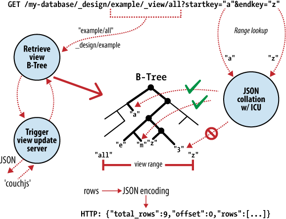

.. Licensed under the Apache License, Version 2.0 (the "License"); you may not
.. use this file except in compliance with the License. You may obtain a copy of
.. the License at
..
..   http://www.apache.org/licenses/LICENSE-2.0
..
.. Unless required by applicable law or agreed to in writing, software
.. distributed under the License is distributed on an "AS IS" BASIS, WITHOUT
.. WARRANTIES OR CONDITIONS OF ANY KIND, either express or implied. See the
.. License for the specific language governing permissions and limitations under
.. the License.

.. _intro/consistency:

====================
Eventual Consistency
====================

In the previous document :ref:`intro/why`, we saw that CouchDB's flexibility
allows us to evolve our data as our applications grow and change. In this topic,
we'll explore how working "with the grain" of CouchDB promotes simplicity in
our applications and helps us naturally build scalable, distributed systems.

Working with the Grain
======================

A *distributed system* is a system that operates robustly over a wide network.
A particular feature of network computing is that network links can
potentially disappear, and there are plenty of strategies for managing this
type of network segmentation. CouchDB differs from others by accepting
eventual consistency, as opposed to putting absolute consistency ahead of raw
availability, like `RDBMS`_ or `Paxos`_. What these systems have in common is
an awareness that data acts differently when many people are accessing it
simultaneously. Their approaches differ when it comes to which aspects of
*consistency*, *availability*, or *partition* tolerance they prioritize.

Engineering distributed systems is tricky. Many of the caveats and "gotchas"
you will face over time aren't immediately obvious. We don't have all the
solutions, and CouchDB isn't a panacea, but when you work with CouchDB's
grain rather than against it, the path of least resistance leads you to
naturally scalable applications.

Of course, building a distributed system is only the beginning. A website
with a database that is available only half the time is next to worthless.
Unfortunately, the traditional relational database approach to consistency
makes it very easy for application programmers to rely on global state,
global clocks, and other high availability no-nos, without even realizing
that they're doing so. Before examining how CouchDB promotes scalability,
we'll look at the constraints faced by a distributed system. After we've seen
the problems that arise when parts of your application can't rely on being
in constant contact with each other, we'll see that CouchDB provides an
intuitive and useful way for modeling applications around high availability.

.. _RDBMS: http://en.wikipedia.org/wiki/Relational_database_management_system
.. _Paxos: http://en.wikipedia.org/wiki/Paxos_%28computer_science%29

.. _cap:

The CAP Theorem
===============

The CAP theorem describes a few different strategies for distributing
application logic across networks. CouchDB's solution uses replication to
propagate application changes across participating nodes. This is a
fundamentally different approach from consensus algorithms and relational
databases, which operate at different intersections of consistency,
availability, and partition tolerance.

The CAP theorem, shown in :ref:`intro/consistency-01`,
identifies three distinct concerns:

- **Consistency**:
  All database clients see the same data, even with concurrent updates.
- **Availability**:
  All database clients are able to access some version of the data.
- **Partition tolerance**:
  The database can be split over multiple servers.

Pick two.

.. _intro/consistency-01:

    Figure 1. The CAP theorem

When a system grows large enough that a single database node is unable to
handle the load placed on it, a sensible solution is to add more servers.
When we add nodes, we have to start thinking about how to partition data
between them. Do we have a few databases that share exactly the same data?
Do we put different sets of data on different database servers?
Do we let only certain database servers write data and let others handle
the reads?

Regardless of which approach we take, the one problem we'll keep bumping into
is that of keeping all these database servers in sync. If you write some
information to one node, how are you going to make sure that a read request
to another database server reflects this newest information? These events
might be milliseconds apart. Even with a modest collection of database
servers, this problem can become extremely complex.

When it's absolutely critical that all clients see a consistent view of the
database, the users of one node will have to wait for any other nodes to come
into agreement before being able to read or write to the database.
In this instance, we see that availability takes a backseat to consistency.
However, there are situations where availability trumps consistency:

    Each node in a system should be able to make decisions purely based on
    local state. If you need to do something under high load with failures
    occurring and you need to reach agreement, you're lost. If you're
    concerned about scalability, any algorithm that forces you to run
    agreement will eventually become your bottleneck. Take that as a given.

    -- Werner Vogels, Amazon CTO and Vice President

If availability is a priority, we can let clients write data to one node of
the database without waiting for other nodes to come into agreement.
If the database knows how to take care of reconciling these operations between
nodes, we achieve a sort of "eventual consistency" in exchange for high
availability. This is a surprisingly applicable trade-off for many applications.

Unlike traditional relational databases, where each action performed is
necessarily subject to database-wide consistency checks,
CouchDB makes it really simple to build applications that sacrifice immediate
consistency for the huge performance improvements that come with simple
distribution.

Local Consistency
=================

Before we attempt to understand how CouchDB operates in a cluster,
it's important that we understand the inner workings of a single CouchDB node.
The CouchDB API is designed to provide a convenient but thin wrapper around
the database core. By taking a closer look at the structure of the database
core, we'll have a better understanding of the API that surrounds it.

The Key to Your Data
--------------------

At the heart of CouchDB is a powerful *B-tree* storage engine.
A B-tree is a sorted data structure that allows for searches, insertions,
and deletions in logarithmic time. As :ref:`intro/consistency-02`
illustrates, CouchDB uses this B-tree storage engine for all internal data,
documents, and views. If we understand one, we will understand them all.

.. _intro/consistency-02:

    Figure 2. Anatomy of a view request

CouchDB uses MapReduce to compute the results of a view. MapReduce makes use
of two functions, "map" and "reduce", which are applied to each document in
isolation. Being able to isolate these operations means that view computation
lends itself to parallel and incremental computation. More important,
because these functions produce key/value pairs, CouchDB is able to insert
them into the B-tree storage engine, sorted by key. Lookups by key,
or key range, are extremely efficient operations with a B-tree,
described in `big O` notation as ``O(log N)`` and ``O(log N + K)``,
respectively.

In CouchDB, we access documents and view results by key or key range.
This is a direct mapping to the underlying operations performed on CouchDB's
B-tree storage engine. Along with document inserts and updates,
this direct mapping is the reason we describe CouchDB's API as being a thin
wrapper around the database core.

Being able to access results by key alone is a very important restriction
because it allows us to make huge performance gains. As well as the massive
speed improvements, we can partition our data over multiple nodes,
without affecting our ability to query each node in isolation.
`BigTable`_, `Hadoop`_, `SimpleDB`_, and `memcached`_ restrict object lookups
by key for  exactly these reasons.

.. _BigTable: http://en.wikipedia.org/wiki/BigTable
.. _Hadoop: http://hadoop.apache.org
.. _SimpleDB: http://aws.amazon.com/simpledb/
.. _memcached: http://memcached.org

No Locking
----------

A table in a relational database is a single data structure. If you want to
modify a table -- say, update a row -- the database system must ensure
that nobody else is trying to update that row and that nobody can read from
that row while it is being updated. The common way to handle this uses what's
known as a lock. If multiple clients want to access a table, the first client
gets the lock, making everybody else wait. When the first client's request is
processed, the next client is given access while everybody else waits,
and so on. This serial execution of requests, even when they arrived in
parallel, wastes a significant amount of your server's processing power.
Under high load, a relational database can spend more time figuring out who
is allowed to do what, and in which order, than it does doing any actual work.

.. note::
    Modern relational databases avoid locks by implementing MVCC under
    the hood, but hide it from the end user, requiring them to coordinate
    concurrent changes of single rows or fields.

Instead of locks, CouchDB uses `Multi-Version Concurrency Control` (MVCC) to
manage concurrent access to the database. :ref:`intro/consistency-03`
illustrates the differences between MVCC and traditional locking mechanisms.
MVCC means that CouchDB can run at full speed, all the time,
even under high load. Requests are run in parallel, making excellent use of
every last drop of processing power your server has to offer.

.. _intro/consistency-03:

.. figure:: ../../images/intro-consistency-03.png
    :align: center
    :alt: MVCC means no locking

    Figure 3. MVCC means no locking

Documents in CouchDB are versioned, much like they would be in a regular
version control system such as `Subversion`_. If you want to change
a value in a document, you create an entire new version of that document
and save it over the old one. After doing this, you end up with two versions
of the same document, one old and one new.

How does this offer an improvement over locks? Consider a set of requests
wanting to access a document. The first request reads the document.
While this is being processed, a second request changes the document.
Since the second request includes a completely new version of the document,
CouchDB can simply append it to the database without having to wait for the
read request to finish.

When a third request wants to read the same document, CouchDB will point it
to the new version that has just been written. During this whole process,
the first request could still be reading the original version.

A read request will always see the most recent snapshot of your database at
the time of the beginning of the request.

.. _Subversion: http://subversion.apache.org/

Validation
==========

As application developers, we have to think about what sort of input we
should accept and what we should reject. The expressive power to do this type
of validation over complex data within a traditional relational database
leaves a lot to be desired. Fortunately, CouchDB provides a powerful way to
perform per-document validation from within the database.

CouchDB can validate documents using JavaScript functions similar to those
used for MapReduce. Each time you try to modify a document,
CouchDB will pass the validation function a copy of the existing document,
a copy of the new document, and a collection of additional information,
such as user authentication details. The validation function now has the
opportunity to approve or deny the update.

By working with the grain and letting CouchDB do this for us,
we save ourselves a tremendous amount of CPU cycles that would otherwise have
been spent serializing object graphs from SQL, converting them into domain
objects, and using those objects to do application-level validation.

Distributed Consistency
=======================

Maintaining consistency within a single database node is relatively easy for
most databases. The real problems start to surface when you try to maintain
consistency between multiple database servers. If a client makes a write
operation on server `A`, how do we make sure that this is consistent with
server `B`, or `C`, or `D`? For relational databases, this is a very complex
problem with entire books devoted to its solution. You could use
multi-master, single-master, partitioning, sharding, write-through caches,
and all sorts of other complex techniques.

Incremental Replication
=======================

CouchDB's operations take place within the context of a single document.
As CouchDB achieves eventual consistency between multiple databases by using
incremental replication you no longer have to worry about your database
servers being able to stay in constant communication. Incremental replication
is a process where document changes are periodically copied between servers.
We are able to build what's known as a *shared nothing* cluster of databases
where each node is independent and self-sufficient, leaving no single point
of contention across the system.

Need to scale out your CouchDB database cluster? Just throw in another server.

As illustrated in :ref:`intro/consistency-04`, with CouchDB's incremental
replication, you can synchronize your data between any two databases however
you like and whenever you like. After replication, each database is able
to work independently.

You could use this feature to synchronize database servers within a cluster
or between data centers using a job scheduler such as cron,
or you could use it to synchronize data with your laptop for offline work as
you travel. Each database can be used in the usual fashion,
and changes between databases can be synchronized later in both directions.

.. _intro/consistency-04:

.. figure:: ../../images/intro-consistency-04.png
    :align: center
    :alt: Incremental replication between CouchDB nodes

    Figure 4. Incremental replication between CouchDB nodes

What happens when you change the same document in two different databases and
want to synchronize these with each other? CouchDB's replication system
comes with automatic conflict detection and resolution. When CouchDB detects
that a document has been changed in both databases, it flags this document
as being in conflict, much like they would be in a regular version control
system.

This isn't as troublesome as it might first sound. When two versions of a
document conflict during replication, the winning version is saved as the
most recent version in the document's history. Instead of throwing the losing
version away, as you might expect, CouchDB saves this as a previous version
in the document's history, so that you can access it if you need to. This
happens automatically and consistently, so both databases will make exactly
the same choice.

It is up to you to handle conflicts in a way that makes sense for your
application. You can leave the chosen document versions in place,
revert to the older version, or try to merge the two versions and save the
result.

Case Study
==========

Greg Borenstein, a friend and coworker, built a small library for converting
Songbird playlists to JSON objects and decided to store these in CouchDB as
part of a backup application. The completed software uses CouchDB's MVCC and
document revisions to ensure that Songbird playlists are backed up robustly
between nodes.

.. note::
    `Songbird`_ is a free software media player with an integrated web browser,
    based on the Mozilla XULRunner platform. Songbird is available for Microsoft
    Windows, Apple Mac OS X, Solaris, and Linux.

    .. _Songbird: http://en.wikipedia.org/wiki/Songbird_%28software%29

Let's examine the workflow of the Songbird backup application,
first as a user backing up from a single computer, and then using Songbird to
synchronize playlists between multiple computers. We'll see how document
revisions turn what could have been a hairy problem into something that *just
works*.

The first time we use this backup application, we feed our playlists to the
application and initiate a backup. Each playlist is converted to a JSON
object and handed to a CouchDB database. As illustrated in
:ref:`intro/consistency-05`, CouchDB hands back the document ID and
revision of each playlist as it's saved to the database.

.. _intro/consistency-05:

.. figure:: ../../images/intro-consistency-05.png
    :align: center
    :alt: Backing up to a single database

    Figure 5. Backing up to a single database

After a few days, we find that our playlists have been updated and we want to
back up our changes. After we have fed our playlists to the backup
application, it fetches the latest versions from CouchDB,
along with the corresponding document revisions. When the application hands
back the new playlist document, CouchDB requires that the document revision
is included in the request.

CouchDB then makes sure that the document revision handed to it in the
request matches the current revision held in the database. Because CouchDB
updates the revision with every modification, if these two are out of sync it
suggests that someone else has made changes to the document between the time
we requested it from the database and the time we sent our updates. Making
changes to a document after someone else has modified it without first
inspecting those changes is usually a bad idea.

Forcing clients to hand back the correct document revision is the heart of
CouchDB's optimistic concurrency.

We have a laptop we want to keep synchronized with our desktop computer.
With all our playlists on our desktop, the first step is to
"restore from backup" onto our laptop. This is the first time we've done this,
so afterward our laptop  should hold an exact replica of our desktop playlist
collection.

After editing our Argentine Tango playlist on our laptop to add a few new
songs we've purchased, we want to save our changes. The backup application
replaces the playlist document in our laptop CouchDB database and a new
document revision is generated. A few days later, we remember our new songs
and want to copy the playlist across to our desktop computer. As illustrated
in :ref:`intro/consistency-06`, the backup application copies the new document
and the new revision to the desktop CouchDB database. Both CouchDB databases
now have the same document revision.

.. _intro/consistency-06:

.. figure:: ../../images/intro-consistency-06.png
    :align: center
    :alt: Synchronizing between two databases

    Figure 6. Synchronizing between two databases

Because CouchDB tracks document revisions, it ensures that updates like these
will work only if they are based on current information. If we had made
modifications to the playlist backups between synchronization,
things wouldn't go as smoothly.

We back up some changes on our laptop and forget to synchronize. A few days
later, we're editing playlists on our desktop computer, make a backup,
and want to synchronize this to our laptop. As illustrated in
:ref:`intro/consistency-07`, when our backup application tries to replicate
between the two databases, CouchDB sees that the changes being sent from our
desktop computer are modifications of out-of-date documents and helpfully
informs us that there has been a conflict.

Recovering from this error is easy to accomplish from an application
perspective. Just download CouchDB's version of the playlist and provide an
opportunity to merge the changes or save local modifications into a new
playlist.

.. _intro/consistency-07:

.. figure:: ../../images/intro-consistency-07.png
    :align: center
    :alt: Synchronization conflicts between two databases

    Figure 7. Synchronization conflicts between two databases

Wrapping Up
===========

CouchDB's design borrows heavily from web architecture and the lessons
learned deploying massively distributed systems on that architecture.
By understanding why this architecture works the way it does,
and by learning to spot which parts of your application can be easily
distributed and which parts cannot, you'll enhance your ability to design
distributed and scalable applications, with CouchDB or without it.

We've covered the main issues surrounding CouchDB's consistency model and
hinted at some of the benefits to be had when you work *with* CouchDB and not
against it. But enough theory -- let's get up and running and see what all the
fuss is about!
