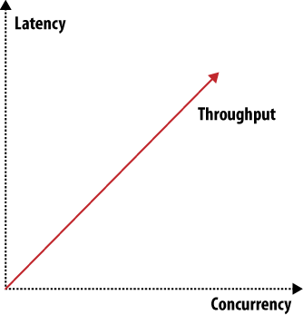

.. Licensed under the Apache License, Version 2.0 (the "License"); you may not
.. use this file except in compliance with the License. You may obtain a copy of
.. the License at
..
..   http://www.apache.org/licenses/LICENSE-2.0
..
.. Unless required by applicable law or agreed to in writing, software
.. distributed under the License is distributed on an "AS IS" BASIS, WITHOUT
.. WARRANTIES OR CONDITIONS OF ANY KIND, either express or implied. See the
.. License for the specific language governing permissions and limitations under
.. the License.

.. _intro/why:

============
Why CouchDB?
============

Apache CouchDB is one of a new breed of database management systems.
This topic explains why there's a need for new systems as well as the
motivations behind building CouchDB.

As CouchDB developers, we're naturally very excited to be using CouchDB.
In this topic we'll share with you the reasons for our enthusiasm.
We'll show you how CouchDB's schema-free document model is a better fit
for common applications, how the built-in query engine is a powerful way
to use and process your data, and how CouchDB's design lends itself
to modularization and scalability.

Relax
=====

If there's one word to describe CouchDB, it is *relax*. It is the byline
to CouchDB's official logo and when you start CouchDB, you see::

    Apache CouchDB has started. Time to relax.

Why is relaxation important? Developer productivity roughly doubled in the
last five years. The chief reason for the boost is more powerful tools that
are easier to use. Take Ruby on Rails as an example. It is an infinitely
complex framework, but it's easy to get started with. Rails is a success
story because of the core design focus on ease of use. This is one reason why
CouchDB is relaxing: learning CouchDB and understanding its core concepts
should feel natural to most everybody who has been doing any work on the Web.
And it is still pretty easy to explain to non-technical people.

Getting out of the way when creative people try to build specialized
solutions is in itself a core feature and one thing that CouchDB aims to get
right. We found existing tools too cumbersome to work with during development
or in production, and decided to focus on making CouchDB easy, even a pleasure,
to use.

Another area of relaxation for CouchDB users is the production setting.
If you have a live running application, CouchDB again goes out of its way
to avoid troubling you. Its internal architecture is fault-tolerant,
and failures occur in a controlled environment and are dealt with gracefully.
Single problems do not cascade through an entire server system but stay
isolated in single requests.

CouchDB's core concepts are simple (yet powerful) and well understood.
Operations teams (if you have a team; otherwise, that's you) do not have to
fear random behavior and untraceable errors. If anything should go wrong,
you can easily find out what the problem is, but these situations are rare.

CouchDB is also designed to handle varying traffic gracefully. For instance,
if a website is experiencing a sudden spike in traffic, CouchDB will generally
absorb a lot of concurrent requests without falling over. It may take a little
more time for each request, but they all get answered. When the spike is over,
CouchDB will work with regular speed again.

The third area of relaxation is growing and shrinking the underlying hardware
of your application. This is commonly referred to as scaling. CouchDB enforces
a set of limits on the programmer. On first look, CouchDB might seem
inflexible, but some features are left out by design for the simple reason
that if CouchDB supported them, it would allow a programmer to create
applications that couldn't deal with scaling up or down.

.. note::
    CouchDB doesn't let you do things that would get you in trouble later on.
    This sometimes means you'll have to unlearn best practices you might have
    picked up in your current or past work.

A Different Way to Model Your Data
==================================

We believe that CouchDB will drastically change the way you build
document-based applications. CouchDB combines an intuitive document storage
model with a powerful query engine in a way that's so simple you'll probably
be tempted to ask, “Why has no one built something like this before?”

    Django may be built for the Web, but CouchDB is built of the Web. I've
    never seen software that so completely embraces the philosophies behind
    HTTP. CouchDB makes Django look old-school in the same way that Django
    makes ASP look outdated.

    -- Jacob Kaplan-Moss, Django developer

CouchDB's design borrows heavily from web architecture and the concepts of
resources, methods, and representations. It augments this with powerful ways
to query, map, combine, and filter your data. Add fault tolerance, extreme
scalability, and incremental replication, and CouchDB defines a sweet spot
for document databases.

A Better Fit for Common Applications
====================================

We write software to improve our lives and the lives of others. Usually this
involves taking some mundane information such as contacts, invoices,
or receipts and manipulating it using a computer application. CouchDB is a
great fit for common applications like this because it embraces the natural
idea of evolving, self-contained documents as the very core of its data model.

Self-Contained Data
-------------------

An invoice contains all the pertinent information about a single transaction
the seller, the buyer, the date, and a list of the items or services sold.
As shown in :ref:`intro/why-01`, there's no abstract reference on this
piece of paper that points to some other piece of paper with the seller's
name and address. Accountants appreciate the simplicity of having everything
in one place. And given the choice, programmers appreciate that, too.

.. _intro/why-01:

.. figure:: ../../images/intro-why-01.png
    :align: center
    :alt: Self-contained documents

    Figure 1. Self-contained documents

Yet using references is exactly how we model our data in a relational
database! Each invoice is stored in a table as a row that refers to other
rows in other tables one row for seller information, one for the buyer,
one row for each item billed, and more rows still to describe the item
details, manufacturer details, and so on and so forth.

This isn't meant as a detraction of the relational model, which is widely
applicable and extremely useful for a number of reasons. Hopefully, though, it
illustrates the point that sometimes your model may not “fit” your data
in the way it occurs in the real world.

Let's take a look at the humble contact database to illustrate a different
way of modeling data, one that more closely “fits” its real-world counterpart
-- a pile of business cards. Much like our invoice example, a business card
contains all the important information, right there on the cardstock.
We call this “self-contained” data, and it's an important concept
in understanding document databases like CouchDB.

Syntax and Semantics
--------------------

Most business cards contain roughly the same information -- someone's identity,
an affiliation, and some contact information. While the exact form of this
information can vary between business cards, the general information being
conveyed remains the same, and we're easily able to recognize it as a
business card. In this sense, we can describe a business card as a *real-world
document*.

Jan's business card might contain a phone number but no fax number,
whereas J. Chris's business card contains both a phone and a fax number. Jan
does not have to make his lack of a fax machine explicit by writing something
as ridiculous as “Fax: None” on the business card. Instead, simply omitting
a fax number implies that he doesn't have one.

We can see that real-world documents of the same type, such as business cards,
tend to be very similar in *semantics* -- the sort of information they carry,
but can vary hugely in *syntax*, or how that information is structured. As human
beings, we're naturally comfortable dealing with this kind of variation.

While a traditional relational database requires you to model your data
*up front*, CouchDB's schema-free design unburdens you with a powerful way to
aggregate your data *after the fact*, just like we do with real-world
documents. We'll look in depth at how to design applications with this
underlying storage paradigm.

Building Blocks for Larger Systems
==================================

CouchDB is a storage system useful on its own. You can build many applications
with the tools CouchDB gives you. But CouchDB is designed with a bigger picture
in mind. Its components can be used as building blocks that solve storage
problems in slightly different ways for larger and more complex systems.

Whether you need a system that's crazy fast but isn't too concerned with
reliability (think logging), or one that guarantees storage in two or more
physically separated locations for reliability, but you're willing to take a
performance hit, CouchDB lets you build these systems.

There are a multitude of knobs you could turn to make a system work better in
one area, but you'll affect another area when doing so. One example would be
the CAP theorem discussed in :ref:`intro/consistency`. To give you an idea of
other things that affect storage systems, see
:ref:`Figure 2 <intro/why-figure-02>` and :ref:`Figure 3 <intro/why-figure-03>`.

By reducing latency for a given system (and that is true not only for storage
systems), you affect concurrency and throughput capabilities.

.. _intro/why-figure-02:

    Figure 2. Throughput, latency, or concurrency

.. _intro/why-figure-03:

.. figure:: ../../images/intro-why-03.png
    :align: center
    :alt: Scaling: read requests, write requests, or data

    Figure 3. Scaling: read requests, write requests, or data

When you want to scale out, there are three distinct issues to deal with:
scaling read requests, write requests, and data. Orthogonal to all three and
to the items shown in :ref:`Figure 2 <intro/why-figure-02>` and :ref:`Figure 3
<intro/why-figure-03>` are many more attributes like reliability or simplicity.
You can draw many of these graphs that show how different features or attributes
pull into different directions and thus shape the system they describe.

CouchDB is very flexible and gives you enough building blocks to create a
system shaped to suit your exact problem. That's not saying that CouchDB can
be bent to solve any problem -- CouchDB is no silver bullet -- but in the
area of data storage, it can get you a long way.

CouchDB Replication
===================

CouchDB replication is one of these building blocks. Its fundamental function
is to synchronize two or more CouchDB databases. This may sound simple,
but the simplicity is key to allowing replication to solve a number of
problems: reliably synchronize databases between multiple machines for
redundant data storage; distribute data to a cluster of CouchDB instances
that share a subset of the total number of requests that hit the cluster
(load balancing); and distribute data between physically distant locations,
such as one office in New York and another in Tokyo.

CouchDB replication uses the same REST API all clients use. HTTP is
ubiquitous and well understood. Replication works incrementally; that is,
if during replication anything goes wrong, like dropping your network
connection, it will pick up where it left off the next time it runs. It also
only transfers data that is needed to synchronize databases.

A core assumption CouchDB makes is that things can go wrong,
like network connection troubles, and it is designed for graceful error
recovery instead of assuming all will be well. The replication system's
incremental design shows that best. The ideas behind “things that can go
wrong” are embodied in the `Fallacies of Distributed Computing`_:

- The network is reliable.
- Latency is zero.
- Bandwidth is infinite.
- The network is secure.
- Topology doesn't change.
- There is one administrator.
- Transport cost is zero.
- The network is homogeneous.

Existing tools often try to hide the fact that there is a network and that
any or all of the previous conditions don't exist for a particular system.
This usually results in fatal error scenarios when something finally goes
wrong. In contrast, CouchDB doesn't try to hide the network; it just handles
errors gracefully and lets you know when actions on your end are required.

.. _Fallacies of Distributed Computing: http://en.wikipedia.org/wiki/Fallacies_of_Distributed_Computing

Local Data Is King
==================

CouchDB takes quite a few lessons learned from the Web,
but there is one thing that could be improved about the Web: latency.
Whenever you have to wait for an application to respond or a website to
render, you almost always wait for a network connection that isn't as fast as
you want it at that point. Waiting a few seconds instead of milliseconds
greatly affects user experience and thus user satisfaction.

What do you do when you are offline? This happens all the time -- your DSL or
cable provider has issues, or your iPhone, G1, or Blackberry has no bars,
and no connectivity means no way to get to your data.

CouchDB can solve this scenario as well, and this is where scaling is
important again. This time it is scaling down. Imagine CouchDB installed on
phones and other mobile devices that can synchronize data with centrally
hosted CouchDBs when they are on a network. The synchronization is not bound
by user interface constraints like sub-second response times. It is easier to
tune for high bandwidth and higher latency than for low bandwidth and very
low latency. Mobile applications can then use the local CouchDB to fetch
data, and since no remote networking is required for that,
latency is low by default.

Can you really use CouchDB on a phone? Erlang, CouchDB's implementation
language has been designed to run on embedded devices magnitudes smaller and
less powerful than today's phones.

Wrapping Up
===========

The next document :ref:`intro/consistency` further explores the distributed
nature of CouchDB. We should have given you enough bites to whet your interest.
Let's go!
